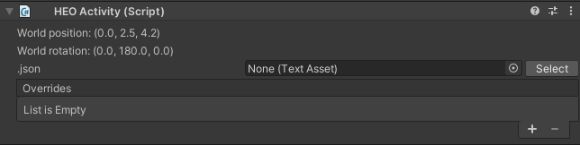
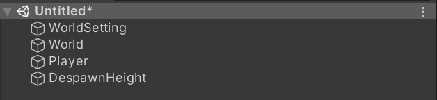
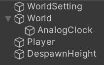
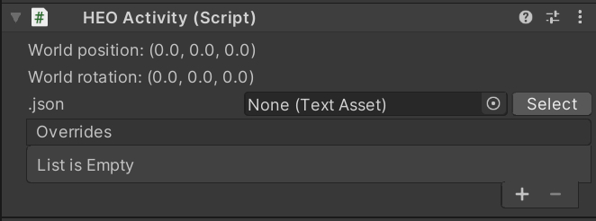
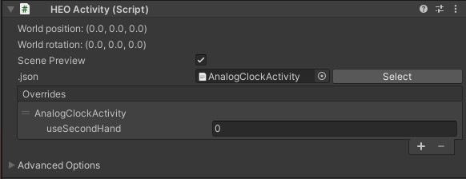
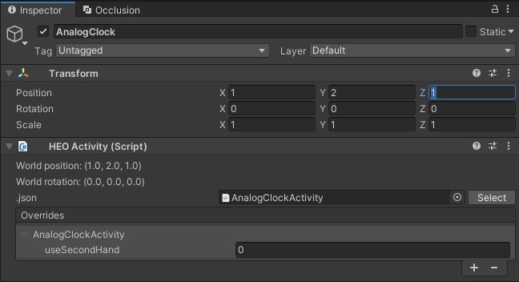

# HEOActivity

HEOActivityはアクティビティを使用する際に設定するコンポーネントです。 
アクティビティとはモデル・スクリプトをひとまとめに統合し、ワールドへの配置と設定を便利にするための機能です。

| 名称 | 機能 |
| ---- | ---- |
| World Position | アクティビティを配置する位置を指定します。 |
| World Rotation | アクティビティを配置する角度を指定します。 |
| .json | アクティビティの情報をまとめたjsonファイルを指定します。|
| Overrides | 各アクティビティに定義されている設定項目を編集します。 |

## 設定方法

例として、ここではアセットストアにて入手したアナログ時計アクティビティを使用します。 
アクティビティの入手方法は後述のマニュアルをご確認ください。

1\. ダウンロードしたActivityファイルを解凍します。OSごとに方法が異なりますが、お好みの方法で解凍してください。

2\. ファイル内容を確認し、必ずREADMEをご確認ください。

3\. 以下READMEの内容を確認し、どのパラメータがカスタマイズできるのかを事前に「アクティビティ設定」項目でご確認ください。

4\. 解凍したanalogclockフォルダーをVketCloudSDKがインストールされているUnityのProjectのアセット内任意のパスに配置してください。

5\. 空のシーンを作成し、シーンにて右クリックした上で "Add Essential Objects for Vket Cloud"を選択して必須コンポーネントを配置します。 その後、アクティビティの配置のために空のオブジェクトを作成します。

6\. 作成した空のオブジェクトの名前をAnalogClockなどに変更します。（他オブジェクトとは別の名称にしてください。）

7\. HEO ActivityコンポーネントをAnalogClockオブジェクトにアタッチします。

8\. activity\analogclock\AnalogClockActivity.jsonをHEO Activityのjson項目にセットします。

9\. HEOActivityのoverridesで"useSecondHand"の設定をします。パラメーターの説明に関してはREADME.mdの「アクティビティ設定」項目を参照して下さい。

10\. オブジェクトの原点にアナログ時計が出現するので、設置場所をTransformで調整します。

11\. ビルドしてアナログ時計が出現していれば完了です。

## アクティビティの入手方法について

Vket Cloudのアクティビティはアセットストアにて入手が可能です。 

アセットストアは[Vket Cloudマイページ](https://cloud.vket.com/)にログイン後、画面上部のタブにおける「アセットストア」からアクセスが可能です。

アセットストアのアクセス方法、使い方の詳細は以下のマニュアルページをご確認ください。
[便利機能をお手軽にインストール！Vket Cloudアセットストア・アクティビティの使い方](https://magazine.vket.com/n/n7d554dbeb552)