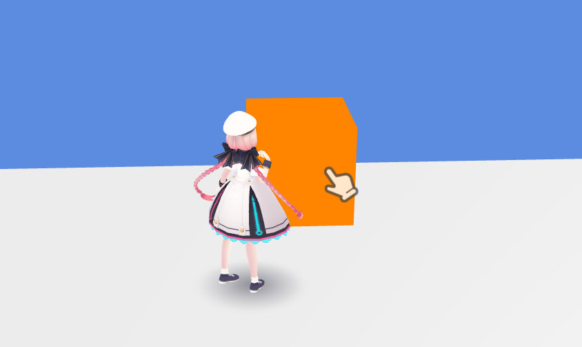

# HEOClickGuide

By selecting `ON`, this component generates gameobjects for showing a click guide within the designated range. 
Selecting `OFF` will **delete** the generated gameobjects.

## Usage
When activating `HEOClickGuide`, the `[objectname_clickArea]` gameobject (henceforth referred as `clickArea`) will be generated as a child object. 
Also, `[objectname_clickArea]` (henceforth referred as `clickguide`) will be generated outside the `World` object.

The `clickArea` gameobject controls the show/hide state of the `clickguide` gameobject, using the [HEOAreaCollider](./HEOAreacollider.md) and [Show/HideItem](../Actions/Item/ShowHideItem.md).

In the initial state, `clickArea` is the same size as the default cube. 
Like the image below, resizing the `clickArea` to designate the zone for click guide appearance is highly recommended.

By modifying `clickArea` using [Enable/DisableClickableNode](../Actions/Node/EnableDisableClickableNode.md), the clickable state of the original object can be toggled.

For example, a clickable webpage gimmick syncronized with the click guide can be implemented.  
This gimmick uses [OpenWeb](../Actions/System/Openweb.md) and a `Clickable` [HEOCollider](./HEOCollider.md) set to the original object.

The `clickguide` object contains a [HEOPlane](./HEOPlane.md) component to show the click guide image. 
In the initial state, the `Billboard` and `Show` is disabled, therefore enabling them are highly recommended.

The appearance of the click guide after build is as below. 

The click guide appearing when the player is inside the `clickArea`:

The click guide disappearing when the player is outside the `clickArea`:

