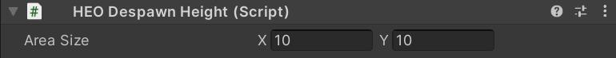

# HEODespawnHeight

!!! note warning
    This component has been deprecated on SDK Ver12.0. 
    As a new feature, [Vket Cloud Settings](../VketCloudSettings/Overview.md) has been added.

HEODespawnHeight will send the player to [HEOPlayer] (HEOPlayer.md), or respawn, when the player reaches the specified height.
Also, if the player falls from the world, it will prevent the state of falling permanently.

| Label | Function |
| ---- | ---- |
| `Area size` | Adjusts the size of the respawn area. |

When you add a component, a red Plane appears on the Unity scene. To adjust the size, please adjust the X value and Y value of `area size`. Height can be manipulated directly from the scene view.

