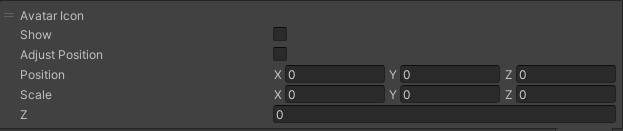
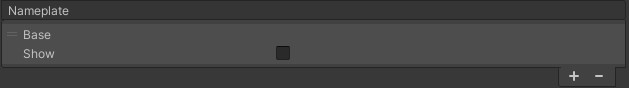
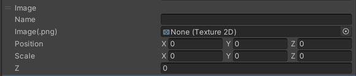
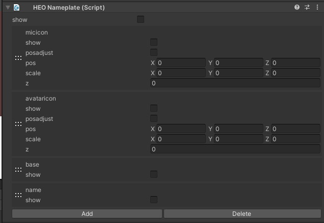

# HEONameplate

HEONameplateは、プレイヤーアバターの頭の上に表示されるネームプレートをカスタマイズしたい場合に設定するコンポーネントです。

Listに各設定要素を追加することで、ビルド後に表示されるプレイヤーのネームプレートをカスタマイズすることができます。

---

## Avatar Icon

ネームプレート左のアバターアイコンの表示を設定します。

| 名称 | 初期値 | 機能 |
| ---- | ---- | ---- |
| Show | false | ネームプレートにAvatar用アイコンを表示するかどうかを決められます。 |
| Adjust Position | false | アバターアイコンの相対位置を調整することができます。`adjustoffsetN`はbaseTexture 0, 1, 2でのマイクアイコンのテクスチャからのオフセットです。初期値はサンプルの値です。Adjust Positionがtrueである必要があります。 |
| Position | 0,0,0 | ビルボードポリゴンはXY方向それぞれ-1.0～1.0の幅2.0になっており、アバターアイコンの位置を調整することができます。 |
| Scale | 0,0,0 | アバターアイコンのスケールを調整することができます。 |
| Z | 0 | アバターアイコンの描画順序を調整することができます。小さい順で描画されます。 |

## Base

ネームプレートの土台部分の表示を設定します。

| 名称 | 初期値 | 機能 |
| ---- | ---- | ---- |
| Show | false | ネームプレートを表示するかどうかを決められます。 |

## Image

ネームプレート以外に画像を追加したい場合に設定します。

| 名称 | 初期値 | 機能 |
| ---- | ---- | ---- |
| Name |  | 画像の名前を決めることができます（ワールドでの挙動に直接には影響はありません）制作の利便性のために画像が何を示しているかのラベルを決めてください。（Base White等） |
| Image(.png) | none | アバターアイコンではなく、画像（アイコン等）をネームプレートに設置することができます。 |
| Position | 0,0,0 | ビルボードポリゴンはXY方向それぞれ-1.0～1.0の幅2.0になっており、画像の位置を調整することができます。 |
| Scale | 0,0,0 | 画像のスケールを調整することができます。 |
| Z | 0 | 画像の描画順序を調整することができます。小さい順で描画されます。 |

本設定によって、例として以下のような白い画像を設定することができます。

## Mic Icon

マイクのアイコンの表示を設定します。

| 名称 | 初期値 | 機能 |
| ---- | ---- | ---- |
| Show | false | 表示切替え |
| Adjust Position | false | マイクアイコンの相対位置を調整することができます。`adjustoffsetN`はbaseTexture 0, 1, 2でのマイクアイコンのテクスチャからのオフセットです。初期値はサンプルの値です。Adjust Positionがtrueである必要があります。 |
| Position | 0,0,0 | ビルボードポリゴンはXY方向それぞれ-1.0～1.0の幅2.0になっており、マイクアイコンの位置を調整することができます。 |
| Scale | 0,0,0 | マイクアイコンのスケールを調整することができます。 |
| Z | 0 | マイクアイコンの描画順序を調整することができます。小さい順で描画されます。 |

## Name

プレイヤーの名前の表示を設定します。

| 名称 | 初期値 | 機能 |
| ---- | ---- | ---- |
| Show | false | ネームプレートに名前を表示するかどうかを決められます。 |

## Text

プレイヤー名以外にテキストを表示したい場合に設定します。

| 名称 | 初期値 | 機能 |
| ---- | ---- | ---- |
| Name | | テキストの名前を決めることができます（ワールドでの挙動に直接には影響はありません）制作の利便性のためにテキストが何を示しているかのラベルを決めてください。  |
| Font Size | 0 | 文字の大きさを指定します。 |
| Texture Size | 0,0 | テキスト表示のベースとなるテクスチャサイズを指定します。**※2のべき乗である必要があります！** |
| Color |　black | テキストの色を設定します |
| Text | | 表示するテキストを設定します |
| Position | 0,0,0 | ビルボードポリゴンはXY方向それぞれ-1.0～1.0の幅2.0になっており、テキストの位置を調整することができます。 |
| Scale | 0,0,0 | ビルボードポリゴンはXY方向それぞれ-1.0～1.0の幅2.0になっており、テキストのスケールを調整することができます。 |
| Z | 0 | テキストの描画順序を調整することができます。小さい順で描画されます。 |
