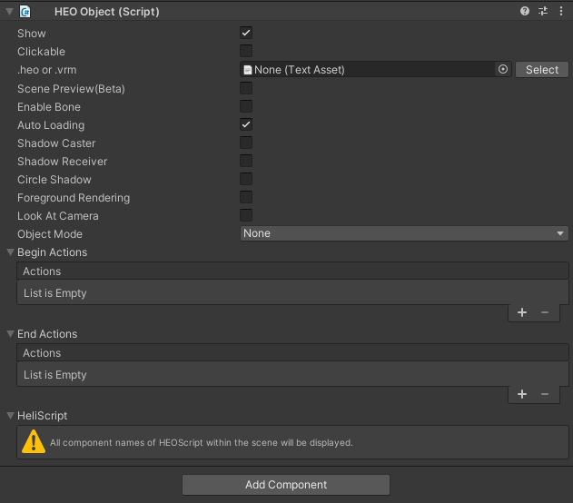

# HEOObject

HEOObjectは、オブジェクトをあらかじめheoファイルとして出力しておき、それらをインスタンス生成するために使用します。heoだけではなく、vrmも配置できます。

|  Label |  function  |
| ----   | ---- |
| .heo or .vrm | heoファイルもしくはvrmファイルを指定します。 |
| enablebone | アーマチュアによるアニメーションを再生する場合はオンにします。（vrmのみ） |
| Object Mode | None、Pose、Motionから任意に選択します。PoseもしくはMotionを選択した場合、追加でhemファイルを指定する必要があります。 |
| Beginactions | モーション再生時にトリガーするアクションを設定できます。 |
