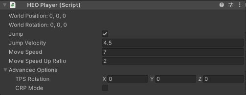

# HEOPlayer

HEOPlayer specifies the spawn point, jump velocity, movespeed, etc. of the player. 
There can only be one HEOPlayer in a Scene.

| Label | Initial Value | Function |
|----|----|----|
| World Position | Same value as Transform's Position value | Set the player's position on spawn |
| World Rotation | Same value as Transform's Rotation value | Set the player's rotation on spawn.   Note that only the Y-Axis value will be applied |
| Jump | true | Enable/Disable jump in world |
| Jump Velocity | 4.5 | Set the upward velocity for jump in world |
| Move Speed | 7.0 | Set m/s speed for player movement in world |
| Move Speed Up Ratio | 2.0 | Set ratio for speed change when player's dashing |
| TPS Rotation | 0,0,0 | Apply the value to the camera's rotation on spawn.   To place the camera on front of the player on enterance, set value to [0.0, 180.0, 0.0] |
| CRP Mode | false | Enable/Disable CRP (protocol for object syncronization on realtime communication).   This is an internal feature, which cannot be used for world creation |

The spawn point will be shown as follows.

For example, the camera on spawn will be rotated as below if `TPS Rotation` is set to (0,180,0).

