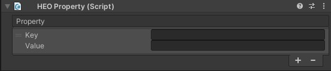
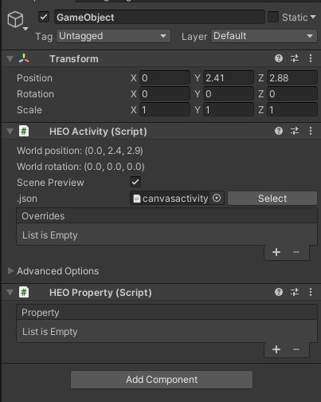

# HEOProperty



## Overview

By using HEOProperty on SDK Ver9.x and later versions, each Item can have a "Property" when in Vket Cloud worlds.

Property is a set of key and value attributed to an Item, which can be used to pass-by-value between components, customize implementation on the Unity editor, and many other usages.

This page will introduce the concept of Property in Vket Cloud, and how to use the HEOProperty.

## How to setup HEOProperty

### 1. Attach HEOProperty to an Item object



Attach HEOProperty to an object that will be an Item, such as [HEOField](HEOField.md), [HEOObject](HEOObject.md), and [HEOActivity](HEOActivity.md).

### 2. Define a Key and Value on HEOProperty

By pressing the "+" button on the List, a new Key and Value can be added.

!!! info "Definition of Property"
    "Property" on Vket Cloud is a feature to define a Key and Value set.<br>
    The defined Value can be read on HeliScript, or written by functions.


Please note that Key and Value will both be a String type.

This completes the setup for HEOProperty.


The defined properties will stored in the Scene.json file after build.

---

## How to Use on HeliScript

The defined property can be used by HeliScript.

For example, a GameObject Item will hold a property as below:

```c#
Key：Vket　Value：Cloud
Key：SDK　Value：12.1
```

### 1. GetProperty

`Item.GetProperty(string Key)` will get a Property Value according to the Item's Key.

```C#
// Sample Code (partial)

Item m_Item;
m_Item = hsItemGet("GameObject");

string Value;
Value = m_Item.GetProperty("Vket");
hsSystemWriteLine("%s" % Value); // output will be "Cloud"

```

### 2. SetProperty

`Item.SetProperty(string Key)` will set a Property Value according to the Item's Key.

```c#

// Sample Code (partial)

Item m_Item;
m_Item = hsItemGet("GameObject");

m_Item.SetProperty("Vket","Chan");

string Value;
Value = m_Item.GetProperty("Vket");
hsSystemWriteLine("%s" % Value); // output will be "Chan"

```

### 3. OnChangedProperty

`OnChangedProperty(string Key, string Value)` is a callback triggered when a property is changed.<br>
This will not be triggered if an exact same Value is entered to a Key on SetProperty, and change did not occur as a result.

```c#

// Sample Code (partial)
Item m_Item;
m_Item = hsItemGet("GameObject");

m_Item.SetProperty("SDK","12.1");
m_Item.SetProperty("Vket","Chan");
m_Item.SetProperty("SDK","12.2");
m_Item.SetProperty("Vket","Chan");

public void OnChangedProperty(string Key, string Value){
  hsSystemWriteLine("Changed %s, %s" % Key % Value);
  if(Key == "Vket"){
    hsSystemWriteLine("Vket Changed");  
  }
}

// On the example above,
// Line 6: initial Value for SDK is 12.1, callback will not be triggered
// Line 7: initial Value for Vket is Cloud, callback will be triggered
// Line 8: Value for SDK is 12.1, callback will be triggered
// Line 9: Value for Vket has been changed to Chan on Line 7, callback will not be triggered
// which will output the result as following:
// Changed Vket, Chan
// Vket Changed
// Changed SDK, 12.2

```

Property can be used on HeliScript by using the 3 functions above.

---

## Usage

Here are some ways to use HEOProperty:

### 1. Pass-by-Value to an Activity

This may be the most primary usage!<br>
On creating an Activity class, HEOProperty can be used to define a configurable value.


By formatting the scene json and reading it by HEOActivity, the result will be as below:


By adding/editing an initial value, this can be read on the Activity's HeliScript using `GetProperty()`.

### 2. Pass-by-Value to a Component

コンポーネント間で値渡しをする際、以下のようにHEOPropertyを使用できます。<br>  
※値を変更する関数を用意して、`hsCallComponentMethod()`を使用しても同じことができます。

```c#
// exampleA exampleBの2つのコンポーネントとKey:status, Value:aliveを持つアイテム「Monster」があり、
// exampleAがもつ変数HPの値が0以下になった際、exampleBで動作が発生する場合

component exampleA{

  int HP;
  Item m_Item;

  public exampleA{
    HP = 20;
    m_Item = hsItemGet("Monster");
  }
  
  public void damage(){
    HP--;
    if(HP<=0){
      m_Item.SetProperty("status","death");
    }
  }
}

component exampleB{

  int status;

  public exampleB{
    status = 1;
  }

  public void OnChangedProperty(string Key, string Value){
    if(Key == "status"){
      switch(Value){
        case: "alive"
          hsSystemWriteLine("モンスターが　あらわれた！");
          status = 1;
          break;
        case: "poison"
          hsSystemWriteLine("モンスターが　どくを　あびた！");
          status = 2;
          break;
        case: "death"
          hsSystemWriteLine("モンスターを　やっつけた！");
          status = -1;
          break;
      }
    }
  }
}
```

### 3. Unityの\[SerializeField\]属性的運用

①のアクティビティへの値渡しと同様に、HEOPropertyから変数の中身を定義するように設定しておくことで、Unityエディタ上でパラメータ設定を行うことができるようになります。

ただし、KeyおよびValueはすべてstring値であることは注意が必要です。

```c#
component exampleC{
  int HP;
  int damage;
  string skill;
  Item m_Item;
  
  public exampleC{
    m_Item = hsItemGet("Monster");
    HP = m_Item.GetProperty("HP").ToInt();
    damage = m_Item.GetProperty("damage").ToInt();
    skill = m_Item.GetProperty("skill");
  }
}

//上記の設定を行い、Unity上で「Monster」オブジェクトに対しHEOPropertyを付け、
//HP:30、damage:3、skill:れんぞく斬り　とした場合、
//それぞれの入力内容がHeliScriptの変数に適用される
```

---

## Notes

### 1. SetProperty / GetPropertyする際は対象となるアイテムに注意

アイテムごとに異なるプロパティを設定することが可能です。<br>  
HeliScript上で対象となるアイテムを間違えると、上手く動作しない場合があるので、気を付けましょう。

!!! note caution
    SDK9.11現在、対象となるプロパティが存在しないのにSetPropertyを行おうとした場合、エラー文も出ずに他のHeliScriptの動作に影響を及ぼす場合があります。

## 2. KeyおよびValueはString型

少し上でも解説した通り、KeyおよびValueはString型となるため、String型以外の変数を扱う場合、SetPropertyやGetPropertyする際に型変換を行う必要があります。

型変換を行わずにSetPropertyやGetPropertyした場合、nullとなります。
