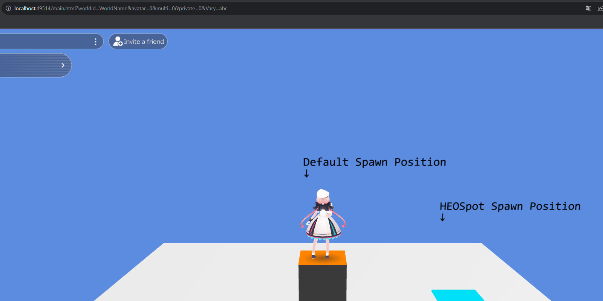

# HEOSpot

HEOSpotはワールド入場時のプレイヤーの初期位置をURLクエリに応じて変更するために使用します。

通常のワールド入場時の初期位置を変更したい場合は[HEOPlayer](HEOPlayer.md)の設定を変更します。

## HEOSpotの設定方法

新規のゲームオブジェクトを作成し、HEOSpotコンポーネントをアタッチした上で名前を`Spot1`, `Spot2`のように任意の`Spot{x}`に設定します。

本ゲームオブジェクトのPositionがURLクエリを適用した際のプレイヤー入場時の初期位置になります。

ワールドにアクセスする際、`&spaceindex=1`のように `spaceindex={x}` というクエリをURL内に追加すると、設定HEOSpotの位置にプレイヤーが配置された状態で入室できます。

URLクエリ未指定時の初期位置：

URLクエリ指定時の初期位置：

