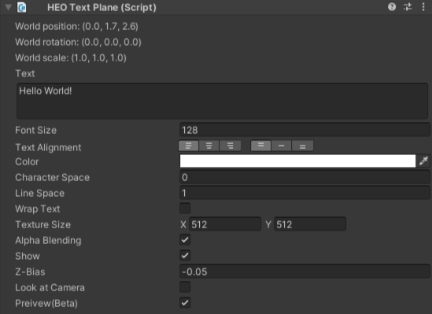

# HEOTextPlane

HEOTextPlaneは、ワールドのビルド時に本コンポーネントがアタッチされたオブジェクトの位置にテキストを表示します。 
ワールドをビルドして実行すると、以下のように表示されます。

## 設定項目

| 名称 | 初期値 | 機能 |
| ----   | ---- | ---- |
| World Position | TransformのPosition値と同一 | テキストを表示する位置を指定します |
| World Rotation | TransformのRotation値と同一 | テキストを表示する角度を指定します |
| World Scale | TransformのScale値と同一 | テキストを表示する大きさを指定します |
| Show | true | ビルド時の初期状態として文字を表示したい場合はオンにします |
| Scene Preview | true | UnityのSceneビューにてプレビューするか否かを設定します。  本機能は試験的な機能です | 
| Look at Camera | false | カメラ方向に対して常に正面を向くようになります |
| Alpha Blending | true | 半透明やカットアウトを使用できます |
| Text | 空欄 | 表示するテキストを入力します |
| Font Size | 128 | 文字の大きさを指定します |
| Text Alignment | Left Top | センタリング等、テキストのアライメント(整列)を指定します。 初期状態では左上に整列されます |
| Color | #FFFFFF | 文字の色を指定します |
| Wrap Text | false | 自動改行するか否かを設定します |
| Texture Size | X:512 Y:512 | テキスト表示のベースとなるテクスチャサイズを指定します  **※2の累乗である必要があります！** |
| Character Space | 0.0| 文字の間隔をピクセル単位で指定します |
| Line Space | 1.0 | 行間隔をピクセル単位で指定します |
| Z-Bias | -0.05 | z値が高いと、ほかのオブジェクトよりも手前に表示されます |
| Overrides | | ワールド入場時に`Overrides`にて設定された`Text`を使用して文字列を上書きします |

!!! note caution
    Overrides項目は現在実装中の機能です。 
    本機能については今後のアップデートで使い方が更新される予定です。

preview設定を有効にすると、以下のようにテキストがSceneビューにて表示されます。

!!! note
    Ver9.0以前の`Billboard`設定は`Look at Camera`に名称が変更されました。 
    以前のSDKバージョンからシーンデータを移植した場合、`Billboard`の設定は`Look at Camera`に引き継がれます。