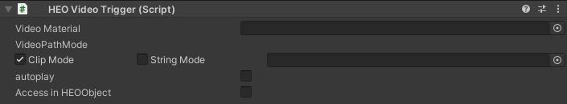

#HEOVideoTrigger

HEOVideoTrigger is used to play the video.

| Label | Details |
| ---- | ---- |
| Video Material | Specify the material on which the video will be run. |
| VideoPathMode | Specify how to find the path to video data. |
| autoplay | Specify whether to automatically play the video. |

## Notes
Make sure to add a HEOField, for this component alone cannot pack video files into .heo.  

If you don't set autoplay, you need to control the start of playback by some means, such as an action.  
The below image uses HEOActionTrigger to implement video playback on click.

## About Video Materials
The Shader of the material needs to be Unlit/Texture.

## About VideoPathMode 
ClipMode refers to data inside the project.  
StringMode refers to the specified URL. It can be used for video streaming, etc.

!!! note caution
    StringMode is currently able only for internal developers. 

    For playing videos, please use the ClipMode.

## About video files to use
Please follow the format below.

| Label | Details |
| ---- | ---- |
| Resolution | 1280x720 H.264 |
| AAC | 44.1 kHz |
| Frame rate | 29.97 or 30 |
| Profile level | 4.1, AAC 44.1kHz, yuv420 |

!!! note caution
    The SDK does not support distance falloff for video audio.
    
    As an alternative implementation, the [HEOAreaCollider](../HEOComponents/HEOAreacollider.md) can be used to stop the video when the player goes out from a certain range.