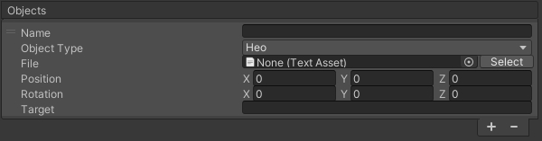

# HEOWorldSetting

HEOWorldSetting manages your World's basic info.
This component lets you configurate the following settings:

- Basic Info
- Camera
- Rendering
- Avatars
- MyAvatar

# Basic Info

|  Label | Initial Value | function |
| ----   | ---- | ---- |
|  `World Name` | "world" | Set the name of the World. This value will be autofilled by the generated world ID on upload, which will mainly be used for the world URL.  (e.g. [VketID_of_Creator].cloud.vket.com/worlds/[World_Name]) |
|  `Debug Mode`  | false |  Switch to debug mode. When switched on, players can use the F1/F2 key to access the debug menu on browser. For details, refer to the [debug mode]((../WorldEditingTips/DebugMode.md)) page.|
| `Use Avatar Click`| true | Activate functions running when clicking other players. |
|  `VRM Drop`  | false | Allows users to locally change their avatar by drag-and-dropping their own .vrm avatars to the browser screen.  |
|  `Occulusion Culling`  | false | Activate the Occulusion Culling. For instructions, please refer to [Occlusion Culling](../WorldMakingGuide/OcclusionCulling.md).  |
|  `World Name Directory`  | false | When exporting to .heo and other files, the files will be packed into a folder with the same name as the `World Name`.  (e.g. data/field/`World Name`/world.heo) |
| `Use GamePad` | false | Activate usage of GamePads.  |
| `Use Physics Engine` | false | Activate usage of the Physics Engine. |
| `Voice Attenuation` | true | Activate player voice attenuation. |
| `Min Distance (m)`| 5.0 | Designate start of voice attenuation by meter. |
| `Max Distance (m)`| 10.0 | Designate end of voice attenuation by meter. |
| `Favicon` | blank | Set the Favicon of the World. |
| `HeliScript` | blank | The HeliScripts used in this world will be listed here. HeliScripts designated in components such as [HEOScript](./HEOScript.md) will be listed automatically. |

!!! note
    While `HeliScript` elements will be added automatically, it may become a `None` or `Missing` entry due to deleting files, etc.
    Note that if the `HeliScript` elements contain a `None` or `Missing` entry, they may become a cause of a build error.

!!! note
        If a gamepad is connected when entering a world with `Use GamePad` enabled, the player may use their gamepad to control. 
        Although control may vary among gamepads, the function shown below are available. 
        Note that changing/adding controls or inverting camera controls for gamepad are unavailable at the current version.

| Label | Function |
|----|----|
| Left stick | Move avatar |
| Right stick | Move camera |
| □ / X / Y　| Jump |
| R3（Pressing down on the right stick）| Reset camera（Reset to initial direction）|

---

## Camera

|  Label | Initial Value | function |
| ----   | ---- | ---- |
|  `Smoothing` | false | Set whether or not the smoothing is applied to the camera movement. |
|  `Far Offset (y-axis)` | 0.0 | Shift the focus point of TPS camera up and down. |
|  `Near Offset` | 0.0 | Shift the focus point of TPS camera up and down. |
| `Photo Radius` | 20.0 | Set the radius of movable range for the photo mode camera. |
| `Raycast Max Distance` | 50.0 | Set the maximum raycast distance from the click detection camera in meter. |
| `TPS Pitch Max Angle` | 6.0 | Set the maximum pitch angle for the TPS camera.  If the player sets the "Eye-level" on the in-world settings to "High", this value will be applied.  If set to "Medium", the halved value will be applied. |
| `Default TPS Camera` | Set the offset for the TPS camera. `center`: right behind (default) `right`: Over the right shoulder（Typical TPS Camera-style）`left`: Over the left shoulder |

---

# Rendering

|  Label | Initial Value | function |
| ----   | ---- | ---- |
|  `PBR` | true |  Enables PBR lighting. |
| `Directional Light` | blank | Set a Directional Light placed in the scene as the directional light for this world. |
| `Fade In Time` | 2.0 | Set the white fade-in length on world enter in seconds.|
| `Shadow Type`| Round | Set the Shadow Type. `round` is a round shadow, and `normalshadowmap` is a normal shadow map.  `normalshadowmap` is used with [HEOShadow](HEOShadow.md).|
| `Shadow Bias` | 0.001 | Set the bias value on drawing shadows.|
| `Shadow Area Size` | 3.0 | Set the distance for drawing shadow in meter.|
| `Shadow Fade Size` | 1.0 |Set the fadeout size growing from the shadow's periphery in meter. |
|  `Projection Near`  | 0.1 | Change the near clipping distance.  |
|  `Projection Far`  | 500.0 | Change the far clipping distance.  |
|  `Projection Degree`  | 70.0 | Change the FoV angle. (default value recommended) |
| `Bloom` | false | Enable/disable bloom. |
| `Light Scattering` | false | Enable/disable light scattering. |
| `IBL` | false | Enable/disable IBL, or Image-Based Lighting. |

!!! note caution
        Note that the Intensity value set on the `Directional Light`(as image below) will not be used within the world. 
        To express light intensity, multiply the `Directional Light`'s color by using the worldsetting's `LightColor` value. 

---

|  Label | Initial Value | function |
| ----   | ---- | ---- |
| `Bloom` | false | Enable/disable bloom. |
| `Bloom Intensity` | 0.2 | Set the strength of the bloom. |
| `Bloom Threshold` | 0.8 | Set the lower limit of brightness at which the bloom takes effect. |
| `Light Scattering` | false | Enable/disable light scattering. |
| `Scattering Intensity` | 0.8 | Set the strength of atmospheric scattering. |
| `Scattering Directivity` | 0.68 | Set the directivity, the degree of concentration of the scattered light. |
| `G` | 0.0 | Set the parameter to adjust the strength of IBL, or Image-Based Lighting. |
| `Distance` | 150.0 | Set the distance at which the light scattering starts. |
| `LightColor` | #FFFFFF | Set the color of the light. |
| `SunColor` | #D9D9FF | Set the color of the sunlight. |
| `IBL` | false | Enable/disable IBL, or Image-Based Lighting. |
| `DiffuseSize` | 512 | Set the size of the diffuse map texture. |
| `SpecularSize` | 512 | Set the size of the specular map texture. |
| `SpecularMipMapCount` | 6.0 | Set the amount of mip maps used for the specular cube map. |

---

# Avatars

|  Label | Initial Value | function |
| ----   | ---- | ---- |
| `Dummy Avatar` | dummy_human_02 | Specify the Dummy Avatar that will be rendered in place of the normal avatar when the avatar is in a distant location or the rendering limit has been reached. |
| `Avatar Files` | Vketchan_v1.6_Mtoon_blendshape | Set the avatar file that handles all the information for avatars. Refer to [this guide](../WorldMakingGuide/AvatarFile.md) for the details about Avatar Files. |
| `CreateAvatarFile` | | Generate a new avatar file. |

!!! note caution
    When updating from Ver5.4 to Ver9.3, the HEOWorldSetting > Avatars > Avatar File settings may be missing, set the file by the procedure below on such occasion.

If the HEOWorldSetting > Avatars > Avatar File settings is empty, or has no contents, it may lead to build errors or no avatars displayed on default. 

As the SDK has a default avatarfile, select this file if there is an empty entry in the list after switching the version.

---

## MyAvatar

|  Label | Initial Value | function |
| ----   | ---- | ---- |
| `Use MyAvatar` | true | Enables/Disables Use of MyAvatars in-world. |
| `NSFW` | false |  Restrict the use of NSFW (Not Safe For Work) avatars.|
| `Polygon` | 50000 | Set the upper limit of polygon count for the MyAvatars in this world. |
| `Motion` | | Set the motion to be used by the MyAvatars.|

---

### Motion

|  Label | Initial Value | function |
| ----   | ---- | ---- |
| `Motion Name` | | Set the motion name. |
| `.hem` | | Set the animation file (.hem) to be played on triggering motion. |
| `loop` | true | Play the motion in a loop. |
| `Use Action` | false | Sets the action to call when the motion starts playing.   In particular, enable this setting and designate the action to be fired via `Setting`. By adding a motion without a `.hem` designated, the motion can be used for purposes such as playing particles on playing motion. |
| `Draw Circle Shadow` | true | Sets to draw a circle shadow on playing motion. |
| `Collision Detection` | true | Sets collision detection on playing motion. |

### About Motions

The default motions/animations are set and used by the SDK. 
By [Preparing an animation and replacing](../HEMAnimationConverter/AnimationConverter.md), MyAvatar's idle, walk, and other motions can be replaced by the animation. 
To edit motions for preset avatars in world, edit the [Avatar File](../WorldMakingGuide/AvatarFile.md) of the preset avatar.

---

### Emotion

|  Label | Initial Value | function |
| ----   | ---- | ---- |
| `Emotion` || Set the emotes to be used by the MyAvatars. |
| `loop` | true | Play the motion in a loop. |
| `Use Action` | false | Sets the action to call when the motion starts playing.   In particular, enable this setting and designate the action to be fired via `Setting`. |

---

### Objects

Set the objects (.heo files, particles, audio) to be attached to the avatar.  
To use 3D models as an object, the file must be [converted to .heo file](../WorldMakingGuide/HEOExporter_Tutorial.md).

|  Label | Initial Value | function |
| ----   | ---- | ---- |
| `Name` | blank | Set the name of the object. |
| `Object Type` | Heo | Set the type of object.  `Heo`: [.heo file](../WorldMakingGuide/HEOExporter_Tutorial.md), `Hep`: particles, `Audio`: audio |
| `File` | blank | Set the file to be used as an object. |
| `Position`| 0,0,0 | Set the relative position from the Target. |
| `Rotation` | 0,0,0 | Set the relative rotation from the Target. | 
| `Target` | blank | Specifies the bone that serves as the coordinate origin.   The bone name is akin to the [VRM Humanoid](https://vrm.dev/en/univrm/humanoid/humanoid_overview), name in snakeCase (e.g. head, leftLowerLeg, leftThumbProximal...)|