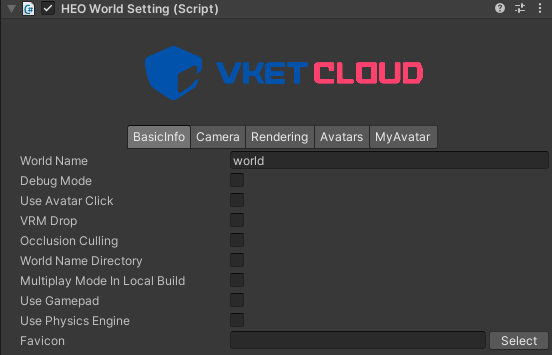
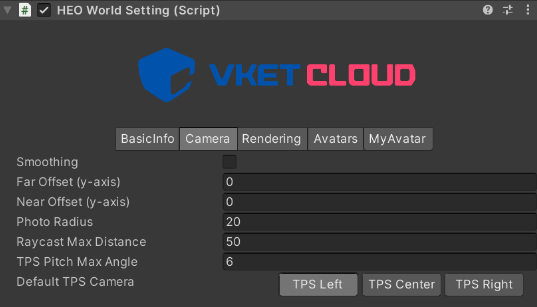
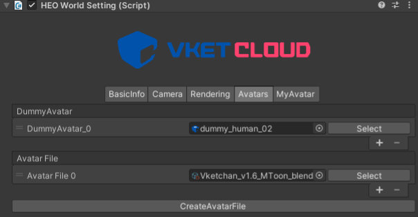
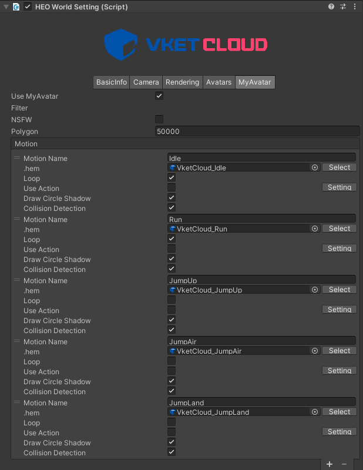

# HEOWorldSetting

HEOWorldSettingはワールドの基本設定を取りまとめるコンポーネントで、以下の設定を管理しています。

- 基本情報
- カメラ設定
- 描画設定
- アバター設定
- マイアバター設定

---

## 基本設定

|  Label |  function  |
| ----   | ---- |
|  `World Name` |  ワールド名を設定する項目です。基本的にはワールド作成時に自動生成されたIDがアップロード時に自動入力され、URLなどに反映されます。  (例：[VketID_of_Creator].cloud.vket.com/worlds/[World_Name])|
|  `Debug Mode` |  デバッグモードを切り替えることができます。オンにするとブラウザ上で`F1`または`F2`からデバッグ機能を使用することが可能になります。|
| `VRM Drop` |  ブラウザ上へのVRMドロップによるローカルの(他プレイヤーから見えない)アバター変更を許可します。 |
| `Occulusion Culling` | オクルージョンカリングをオンにします。　|
| `World Name Directory` | .heoファイルなどの出力時に、ワールド名の付いたフォルダにまとめます。 (例： data/field/`ワールド名`/world.heo)|
| `Multi Play Mode In Local Build` | ローカルビルド時にマルチプレイモードで入室します。 |
| `Use GamePad` | ゲームパッドを使用するかどうかの設定です。 |
| `Use Physics Engine` | 物理エンジンを使用するかどうかの設定です。 |
| `Favicon` | Faviconを設定する項目です。 |

!!! note
        環境にゲームパッドが接続されている状態で`Use GamePad`が有効になっているワールドに入場すると、ゲームパッドによる操作が可能となります。 
        使用するゲームパッドによって操作方法が異なる場合がありますが、基本的には以下の操作が可能です。 
        なお、キー割り当ての変更/追加、ゲームパッドによるカメラ操作の反転については現バージョンでは非対応です。

| 名称 | 機能 |
|----|----|
| 左スティック | アバター移動 |
| 右スティック | カメラ操作 |
| □ / X / Y　| ジャンプ |
| R3（右スティック押し込み）| カメラリセット（初期方向に戻る）|

---

## カメラ設定

|  Label |  function  |
| ----   | ---- |
|  `Smoothing` | カメラの上下の動きにスムージングをかけるかどうかを指定します。 |
|  `far Offset` | TPSカメラの注視点を上下に調整できます。 |
|  `near Offset` | TPSカメラの注視点を上下に調整できます。 |
| `Photo Radius` | 撮影モードカメラの移動可能半径を指定します。|
| `Raycast Max Distance` | クリック判定をおこなうカメラからの最大距離をメートル単位で指定します。 |
| `Default TPS Camera` | TPSカメラのオフセットを指定できます。`center`：真後ろ（デフォルト）`right`：右肩越し（一般的なTPSカメラ）`left`：左肩越し |

---

## 描画設定

|  Label |  function  |
| ----   | ---- |
| `PBR` |  PBRライティングをオンにします。|
| `Directional Light` | シーンに設置されたディレクショナルライトをワールドライトとして指定します。 |
| `Fade In Time` |　ワールド入場時のホワイトフェードインの時間を秒単位で指定します。|
| `Shadow Type`|　影の描画方法を指定します。`round`は 丸影、`normalshadowmap`は通常のシャドウマップです。|
| `Shadow Bias` |　影描画のバイアス値を設定します。|
| `Shadow Area Size` |　シャドウを描画する距離をメートル単位で指定します。|
| `Shadow Fade Size` |　シャドウ外周に向かってフェードアウトする距離をメートル単位で指定します。　|
| `Projection Near` |  近傍のクリッピング距離を指定します。 |
| `Projection Far` | 遠方のクリッピング距離を指定します。  |
| `Projection Degree` | 画角を指定します。（デフォルト値推奨） |
| `Bloom` | ブルームのオンオフを切り替えます。 |
| `Light Scattering` | ライトスキャッタリングのオンオフを切り替えます。 |
| `IBL` | IBL（Image-Based Lighting）のオンオフを切り替えます。 |

!!! note caution
        `Directional Light`に設定されているIntensityの値（下記画像参照）はワールドに反映されないためご注意ください。 
        ライトの強弱は`LightColor`の色を`Directional Light`側の色と重ね合わせることで表現が可能です。

---

|  Label |  function  |
| ----   | ---- |
| `Bloom` | ブルームのオンオフを切り替えます。 |
| `Bloom Intensity` | ブルームの強さを設定します。|
| `Bloom Threshold` | ブルームの閾値を設定します。 |
| `Light Scattering` | ライトスキャッタリングのオンオフを切り替えます。 |
| `Scattering Intensity` | 空気散乱強度を設定します。 |
| `Scattering Directivity` | 拡散指向性を調整します。 |
| `G` | IBLの強さを調整するパラメータを設定します。 |
| `Distance` | 効果開始距離を設定します。 |
| `LightColor` | ライトカラーを指定します。 |
| `SunColor` | 太陽光色を設定します。 |
| `IBL` | IBL（Image-Based Lighting）のオンオフを切り替えます。 |
| `DiffuseSize` | ディフューズマップのサイズを指定します。 |
| `SpecularSize` | スペキュラマップのサイズを指定します。 |
| `Specular Mip Map Count` | スペキュラ用キューブマップのミップマップの数を指定します。 |

---

## アバター設定

|  Label |  function  |
| ----   | ---- |
| `Dummy Avatar` | 遠方や描画制限がかかった場合に描画するダミーアバターを指定します。 |
| `Avatar Files` | アバター情報をまとめたアバターファイルを指定します。アバターファイルについては、[こちら](../WorldMakingGuide/AvatarFile.md)をご覧ください。 |
| `CreateAvatarFile` | 新規のアバターファイルを生成します。 |

---

## マイアバター設定

|  Label |  function  |
| ----   | ---- |
| `NSFW` |  NSFW（Not Safe For Work: 閲覧注意）なアバターの表示を制限します。|
| `Polygon` | そのワールド内で使用できるマイアバターのポリゴン上限を指定します。 |
| `Motion` | マイアバターが使用するモーションを指定します。|

---

|  Label |  function  |
| ----   | ---- |
| `Emotion` | マイアバターが使用するエモートを指定します。|
| `Objects` | マイアバターに物を持たせたい場合に、モデルを指定します。|