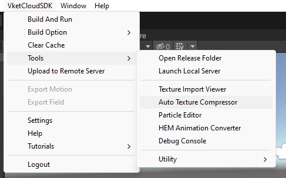
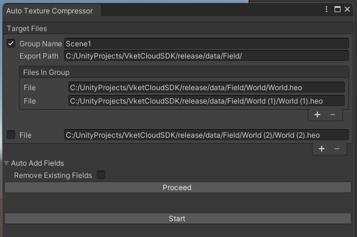

# Auto Texture Compressor

## Overview

Auto Texture Compressor is a tool used to compress in-world textures.

## Preparation

1. To use this tool, you need to install the following external tools:

    - [PVRTexTool](https://developer.imaginationtech.com/pvrtextool/){target=_blank}
    - [Textconv](https://github.com/microsoft/DirectXTex){target=_blank}

    After installation, ensure that the folder containing `PVRTexTool\CLI\Windows_x86_64\PVRTexToolCLI.exe` is added to your system PATH. (The steps for this are omitted here.)

2. From the menu bar, select **VketCloudSDK -> Build And Run** to generate textures within the world that will be compressed under the release folder in advance.

---

## How to Start

Auto Texture Compressor can be launched by selecting **VketCloudSDK --> Tools --> Auto Texture Compressor** from the menu bar.

## Function Description

| English | Description |
|----|----|
| Target Files | Displays a list of files that are targeted for texture compression |
| Checkbox (unchecked)  | If unchecked, compresses only one heo file without using HEOSameTexOptimizer |
| Group Name | Determines the folder name for creating new folders and placing new files after HEOSameTexOptimizer completes its processing |
| Export Path | Sets where HEOSameTexOptimizer should create new folders |
| Files In Group  | Allows adding or removing files from the list of files in this group |
| File Checkbox (checked)  | If checked, groups multiple [VKC Item Field](../VKCComponents/VKCItemField.md) components for optimization with HEOSameTexOptimizer |
| Auto Add Fields | (Optional) Automatically adds [VKC Item Field](../VKCComponents/VKCItemField.md) to this tool’s window when added to the currently open scene |
| Remove Existing Fields | When enabled, removes all previously listed fields before automatically adding new [VKC Item Field](../VKCComponents/VKCItemField.md) components |
| Proceed| Button to activate the auto field addition feature |
| Start | Begins the texture compression process |

## Usage

By configuring the settings as shown in the function description image and starting the tool, the following processes occur:

1. A `.bat` file for compressing `World.heo` is launched

2. The `HEOTexComp` tool operates on `World.heo`

3. A `.bat` file for compressing `World (1).heo` is launched

4. The `HEOTexComp` tool operates on `World (1).heo`

5. `HEOSameTexOptimizer` starts, consolidates the compression results into a folder named `Scene1`, and copies it to `release/data/Field`

6. A `.bat` file for compressing `World (2).heo` is launched

7. The `HEOTexComp` tool operates on `World (2).heo`

## Notes

### About Auto Add Fields

When the "Remove Existing Fields" checkbox is unchecked, "Auto Add Fields" will add only new files that are not already included, and without duplication.

Auto Add Fields will be done in the following cases even when the "Proceed" button is not pressed:

- When the window is opened

- When the scene hierarchy is updated

### Notes on Auto Texture Compressor

- If no actual heo files are selected, the Start button will be disabled and cannot be pressed. Please ensure at least one file is selected.
