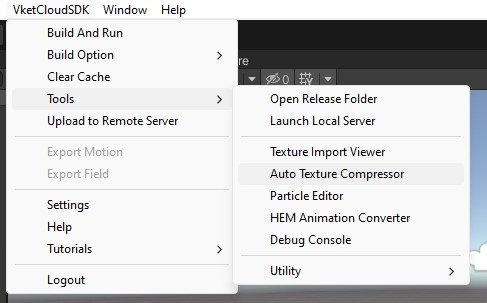

# Auto Texture Compressor

## 概要

Auto Texture Compressorとは、ワールド内のテクスチャをツールによって圧縮して保存するためのツールです。

## 事前準備

1. 本ツールを使用するには、以下の外部ツールをインストールする必要があります。

    - [PVRTexTool](https://developer.imaginationtech.com/pvrtextool/){target=_blank}
    - [Textconv](https://github.com/microsoft/DirectXTex){target=_blank}

    インストール後、`PVRTexTool\CLI\Windows_x86_64\PVRTexToolCLI.exe`が格納されているフォルダのPATHを通しておきます。（本項では手順について省略いたします。）

2. メニューバーにて**VketCloudSDK -> Build And Run**を選択し、テクスチャ圧縮の対象となるワールド内のテクスチャをreleaseフォルダ下にあらかじめ生成します。

---

## 起動方法

Auto Texture Compressorは、メニューバーにて**VketCloudSDK --> Tools --> Auto Texture Compressor**を選択するとウィンドウが表示されます。

## 機能説明

| 英語 | 日本語 | 説明 |
|----|----|----|
| Target Files | 対象ファイル | テクスチャ圧縮の対象となっているファイルのリストが表示されます |
| Checkbox (unchecked) | チェックボックス（無効） | チェックボックスを無効にすると、HEOSameTexOptimizerを使わずに1つのheoファイルだけを圧縮します |
| Group Name | グループ名 | HEOSameTexOptimizerが自らの処理を終えた途端、どのフォルダ名で新しいフォルダーを作って新ファイルを入れるのか決定します |
| Export Path | 出力パス | HEOSameTexOptimizerがどこで新しいフォルダを作成すべきか設定します |
| Files In Group | グループ内容 | このグループに入っているファイルリストにファイルを追加したり削除したりすることができる |
| File Checkbox (checked) | チェックボックス（有効） | チェックボックスを有効にすると、複数の[VKC Item Field](../VKCComponents/VKCItemField.md)をグループで纏めてHEOSameTexOptimizerで最適化することになります |
| Auto Add Fields | 自動フィールド追加 | 【任意のオプション】現在開かれているシーンにて[VKC Item Field](../VKCComponents/VKCItemField.md)が追加された場合、自動的にこのツールのウィンドウに追加できます |
| Remove Existing Fields | 既存フィールド削除 | このチェックボックスを有効にすると、自動的にフィールドを追加する場合、その前に書いてあったフィールドの全部が削除され、ゼロから新しく見つけた[VKC Item Field](../VKCComponents/VKCItemField.md)が追加されます |
| Proceed | 進む | 自動フィールド追加機能を起動するボタン |
| Start | スタート | テクスチャ圧縮を開始します |

## 使用例

機能説明の参考画像のように設定を行い、ツールを起動すると以下の処理が行われます：

1. `World.heo`の圧縮用`.bat`ファイルが起動される

2. `World.heo`に対して`HEOTexComp`というツールが動作する

3. `World (1).heo`の圧縮用`.bat`ファイルが起動される

4. `World (1).heo`に対して`HEOTexComp`というツールが動作する

5. `HEOSameTexOptimizer`が起動され、圧縮結果を`Scene1`という名前のフォルダで纏めて、`release/data/Field`にコピーする

6. `World (2).heo`の圧縮用`.bat`ファイルが起動される

7. `World (2).heo`に対して`HEOTexComp`というツールが動作する

## 注意点

### 自動フィールド追加について

自動フィールド追加は、「Remove Existing Fields / 既存フィールド削除」というチェックボックスが無効になっている場合、重複せずにまだ入っていないファイルだけを追加します

Proceed / 進むボタンを押さなくても、以下の場合には自動フィールド追加が行われます：

- ウィンドウが開いた時

- シーンのヒエラルキーが更新された時

### Auto Texture Compressorに関する注意

- 実際に存在するheoファイルが1つでも選択されていない場合、スタートボタンが無効になって押せなくなります。必ずひとつは選択するようにご注意ください。
