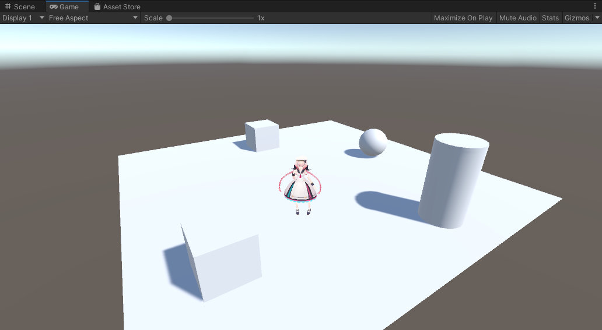

# Scene Preview (β)

On SDK Ver13.4, scene preview on Unity has been added as an easier alternative for [Build & Run](../FirstStep/BuildAndRun.md) world check.  
Using this feature, world creators can quickly check world & player actions without build.

!!! caution "About β feature"
    This feature is currently a beta feature, which includes functions currently not fully implemented. 
    These features are planned to be implemented in future SDK versions.

## How to Use

After saving your scene, press the Play button (▶) on top of the Unity editor.

On the Game window, the default player avatar set in [AvatarSettings](../VketCloudSettings/AvatarSettings.md) (No.0) will spawn. 
As like usually built worlds, the player can be moved by WASD keys, jump by space key, and move camera by mouse dragging.

## Notes

In the current version, objects with the components below cannot be displayed / function in the scene preview.

### VKCSettings

- [BasicSettings](../VketCloudSettings/BasicSettings.md)
  - Features available only on browser:
    - Gamepad Mode
    - Use Avatar Click
    - Occlusion Culling
    - Physics Engine
  - Multiplayer features
    - Voice Attenuation
    - Text chat
    - Change avatar

- [MyAvatarSettings](../VketCloudSettings/MyAvatarSettings.md)
  - Motion
  - Emotion
  - Objects

- [CameraSettings](../VketCloudSettings/CameraSettings.md)
  - Settings related to camera zoom (TPS Max Distance / Max Pitch Angle)

### Attribute

- [VKCAttributeClickGuide](../VKCComponents/VKCAttributeClickGuide.md)

### Node

- [VKCNodeRotateAnimation](../VKCComponents/VKCNodeRotateAnimation.md)
- [VKCNodeUVScroller](../VKCComponents/VKCNodeUVScroller.md)
- [VKCNodeShadow](../VKCComponents/VKCNodeShadow.md)
- [VKCNodeMirror](../VKCComponents/VKCNodeMirror.md)

### Item

- [VKCItemSpot](../VKCComponents/VKCItemSpot.md)
- [VKCItemCamera](../VKCComponents/VKCItemCamera.md)
- [VKCItemBackgroundTexture](../VKCComponents/VKCItemBackgroundTexture.md)
- [VKCItemAudio](../VKCComponents/VKCItemAudio.md)

### Other components

- SkinnedMeshRenderer

Also, gimmick related components such as HeliScript, [VKCNodeVideoTrigger](../VKCComponents/VKCNodeVideoTrigger.md), [VKCAttributeActionTrigger](../VKCComponents/VKCAttributeActionTrigger.md), and [VKCItemAreaCollider](../VKCComponents/VKCItemAreaCollider.md) will not operate on Unity scene preview. 
To check these functions, please use [Build & Run](../FirstStep/BuildAndRun.md).
