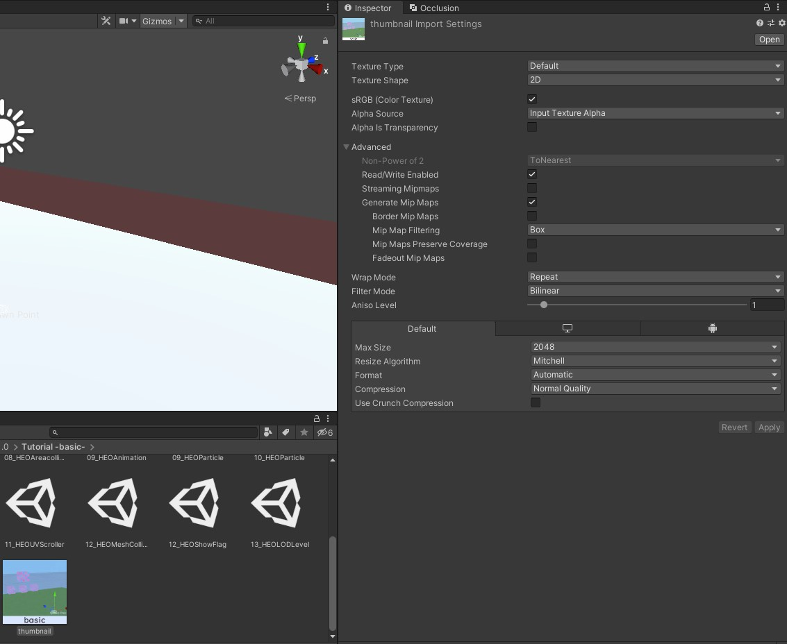

# Texture Import Viewer

## 概要

Texture Import Viewerは、プロジェクト内にあるテクスチャのインポート設定や圧縮サイズなどを一覧で確認できるVketCloudSDK独自のビューワーツールです。

Viewer上からテクスチャのインポート設定をまとめて変更したり、あるいは容量順に並び替えたりすることもできます。 
また、リスト上で各テクスチャ設定項目を編集し、設定をまとめて保存もしくは[Export Compressed Texture](./ExportCompressedTexture.md)と同じ手法でテクスチャファイルのエクスポート・画像差し替えが行えます。

まとめて画像の再フォーマットを行いたい際に便利なツールです。

## 使用方法

Unity上部のメニューから、VketCloudSDK > Tools > TextureImportViewerを選択し、Viewerのウィンドウを開きます。

Viewerを開いた直後は上記のような表示になります。

以下の検索オプションを設定し、「Update Texture List」を押すとテクスチャ情報がリスト表示されます。

### 検索オプション

| 名称 | 初期値 | 機能 |
| ---- | ---- | ---- |
| Ignored Folders (Size / Element)| 1, Assets/IgnoredFolderName | テクスチャ検索時に除外するフォルダを名前によって指定します。 Sizeの数値を増やすと指定できるフォルダ数が増えます。 |
| Find scene textures only | true | 現在開かれているシーン内に使われているテクスチャのみを検索の対象にします。 チェックボックスが空の場合はAssetsフォルダ内の全てのテクスチャが対象になります(検索時間増加) |
| Show Optional Info | true | 画像の詳細情報欄(Compression,Compressor Quality,Compressed Size(KB),Compressed Pixel)の表示/非表示を選択できます |
| Load raw pixel (increases search time) | false | 圧縮前テクスチャのピクセルを読み込みます(注意：処理時間が非常に増えます)  |
| Is NPOT only | false | 圧縮前テクスチャがNPOTのみ検索 Load raw pixelをtrueにすると設定できるようになります。 |

「Load raw pixel (日本語名：圧縮前テクスチャのピクセルを読み込む)」にチェックを入れると、テクスチャ本来のピクセルサイズが表示されるようになりますが、読み込み時間が激増するためScene外のテクスチャも読み込む場合は注意してください。

### Viewerでの操作について

Viewer上で各テクスチャをクリックすると、指定されたテクスチャをAssetsにて選択した上でInspectorに表示します。 
このとき、ShiftやCtrlボタンを押しながら項目をクリックすると複数選択が可能です。

テクスチャリストのヘッダーをクリックすると、その列内で昇順または降順で並び替えできます。

Texture Type ~ Use Crunch Compressionの各テクスチャ設定項目を編集し、「Apply」を選択すると設定をまとめて保存することができます。 
このとき、テクスチャを選択してCompress Selected、あるいはCompress Allを選択すると[Export Compressed Texture](./ExportCompressedTexture.md)と同じ手法でテクスチャファイルのエクスポート・画像差し替えを行います。

---

## Texture Import Viewerの機能

| 名称 | 機能 |
| ---- | ---- |
| Compress Selected (日本語名：選択をエクスポート) | 画像名の横のチェックボックスがついているものを対象に、[Export Compressed Texture](./ExportCompressedTexture.md)と同じ手法で、画像をエクスポートします。 |
| Compress All (日本語名：全てをエクスポート) | 現在のテクスチャ一覧全ての画像を[Export Compressed Texture](./ExportCompressedTexture.md)と同じ手法で、エクスポートします。 |
| Revert | 元に戻す |
| Apply | 適用する |
| Copy | 画像が保存されているパスをクリップボードにコピーします |
| Jump | 画像が保存されているフォルダの場所を開きます |

Export Compressed Textureについては[こちらのページ](./ExportCompressedTexture.md)をご覧ください。
