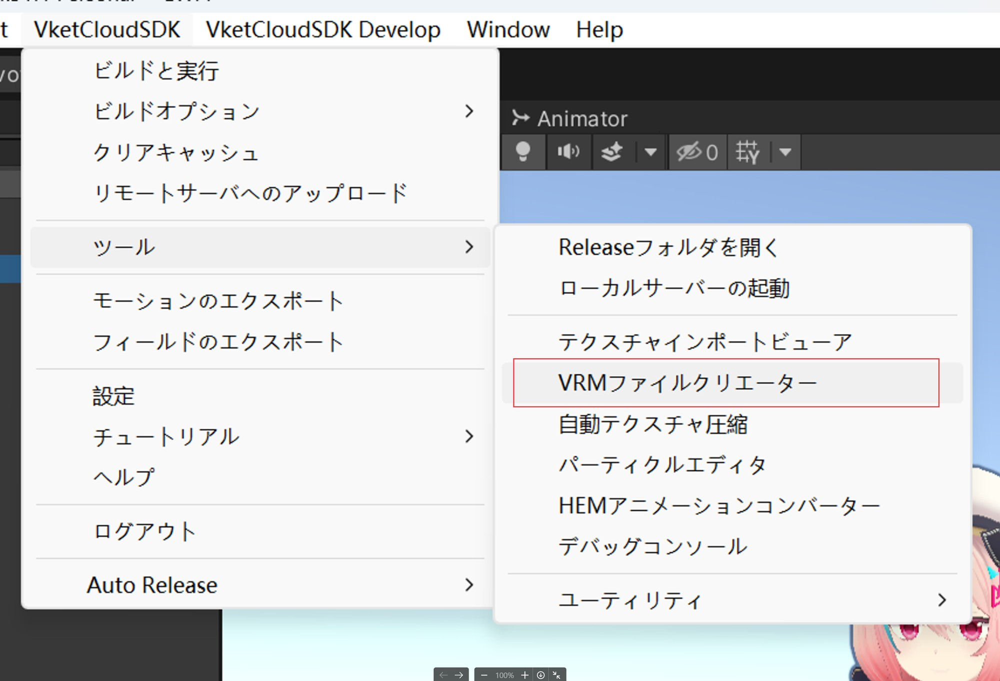
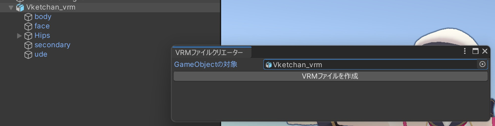
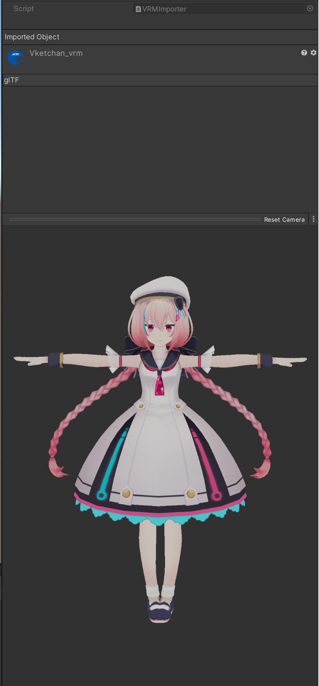

# VRMファイルクリエーターについて

VRMファイルクリエーターはFBXファイルからVRMファイルを作成するツールです。  
今のバージョンでサポートできない機能がこのドキュメントの末尾に書いてあります。

## ツールの使い方

1. **VRMファイルクリエーターツールの起動**  
「VketCloudSDK/ツール/VRMファイルクリエーター」ボタンをクリックしてツールを開きます。

2. **オブジェクトの指定**  
ヒエラルキービューからオブジェクトを「GameObjectの対象」枠にドラックします。

3. **ファイルパスの選択**  
「VRMファイルを作成」ボタンをクリックし、表示されるダイアログからファイルのパスを選択します。

4. **ファイルの作成開始**  
保存ボタンをクリックすると、VRMファイルの作成が開始されます。

5. **ファイルの確認**  
VRMファイルが作成されたら、Projectビューで作成したファイルをクリックして、inspectorからVRMファイルをプレビューできます。

## サポートしない機能

- **BlendShape機能**  
  まだサポートしていません。

- **シェーダー**  
  MToonシェーダーしかサポートしていません。

- **テクスチャー**  
  PNGのテクスチャーしかサポートしていません。

- **シーンデータ作成機能**  
  シーンデータを作成する機能はサポートしていません。

- **UV**  
  UVは一組のみサポートしています。
