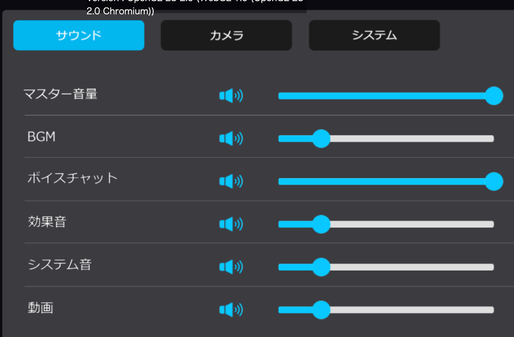

# HEOAudio

|  Label |  function  |
| ----   | ---- |
| `オーディオタイプ` | BGM、効果音、システム効果音から選択できます。 |
| `オーディオクリップ` | オーディオファイルを指定します。 |
| `ループ` | 繰り返し再生するかどうか設定します。 |
| `自動再生` | ワールドBGMのように、入室後から自動で再生する場合に使用します。 

それぞれのオーディオタイプは、インゲームコンフィグのラベルに対応しています。

|  Audio Type |  In-game config label  |
| ----   | ---- |
| `BGM` | BGM |
| `効果音` | 効果音 |
| `システム効果音` | システム音 |

!!! note caution
    BGMは以下の点に注意が必要です。

    - 動画再生時には、動画の音声が優先されます。
    - 距離減衰には対応していません。