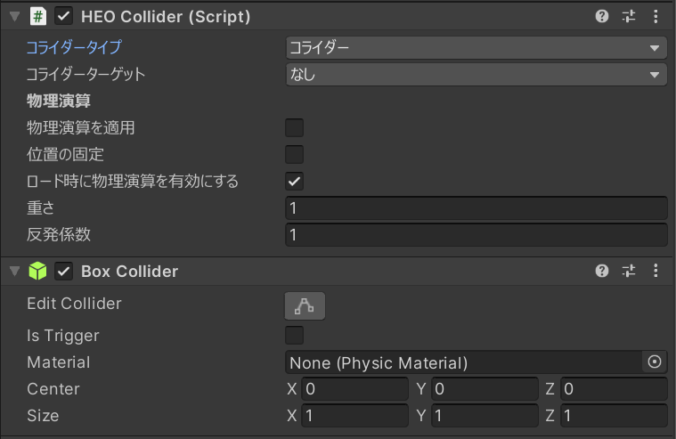

# HEOCollider

HEOColiderとは、設定したBox Coliderに対してどのような挙動をもたせるか設定できるコンポーネントです。

| ラベル | 機能 |
| ---- | ---- |
| コライダータイプ | コライダーのタイプを指定します。 |
| コライダーターゲット | ターゲットを指定します。 |
| 物理演算を適用 | Box Coliderに対して物理演算を可能にします。 |
| 位置の固定 | Box Coliderの位置を固定することができます。 |
| ロード時に物理演算を有効にする | オブジェクトが読み込まれた際に物理演算を有効にするかどうかを選択できます。 |
| 重さ | 重さパラメータを調整します。 |
| 反発係数 | 反発係数のパラメータを調整します。 |

## コライダータイプ
| タイプ | 機能 |
| ---- | ---- |
| コライダー | コライダーの役割を果たします。 | 
| クリック対象 | プレイヤーがクリックすることを可能にします。|
| エリア | 通過することのできるコライダーです。HEOAreaColliderと組み合わせることで、範囲内に入った任意のアクションを設定できます。 | 
| オクルージョン | 接触した際にオクルージョンを有効にします。 |
| リフレクションプローブ | 接触した際にリフレクションプローブを有効にします。 |
| 描画判定 |　視野に入ったかどうかを判定したい場合に扱います  |

## コライダーターゲット
| ターゲット |
| ---- | 
| なし |
| アバター |
| カメラ |
