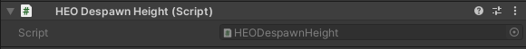

# HEODespawnHeight
HEODespawnHeightを使用することにより、プレイヤーが指定した位置に到達した際に[HEOPlayer](HEOPlayer.md)へリスポーンするようになります。
また、プレイヤーが落下してしまった場合、永続的に落下し続ける状態になってしまうのを防ぐことができます。

|  ラベル  |  機能  |
| ----   | ---- |
| `エリアサイズ` | リスポーンエリアのサイズを調整します。 |

コンポーネントを追加するとUnityのシーン上に赤いPlaneが出現します。サイズの調整は`エリアサイズ`のX値Y値を調整してください。高さはシーンビューから直接操作します。

