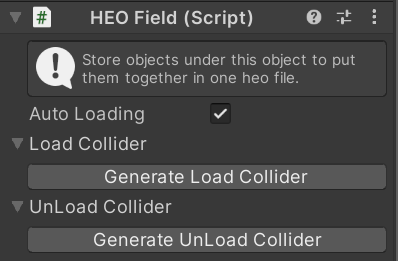

# HEOField

An Object attached with an HEOField will be packed into an .heo file when you BuildAndRun. If you want your Objects to show up in the build, make sure to child them under HEOField.

Multiple HEOFields can be placed within a Scene.

In VketCloud, it is possible to implement objects that load when you enter a specific area after entering a world.

## Setting up Auto Loading

1. Uncheck the "Auto Loading" option in the HEOField component of the object to be loaded.
2. Open the Load Collider section and click "Generate Load Collider" to generate an area collider for loading.
3. Make the generated load collider a child object of the HEOField that is loaded from the beginning, and adjust the position and range.

## Setting up Unloading
1. Open the UnLoad Collider section and click "Generate UnLoad Collider" to generate an area collider for unloading.
2. Make the generated unload collider a child object of the HEOField and adjust the position and range.

## Notes
To remove a set collider, you can click the X button on the right side of the item to remove it from the list, but the object will remain, so you will need to manually delete it.
