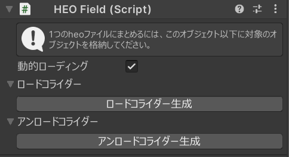
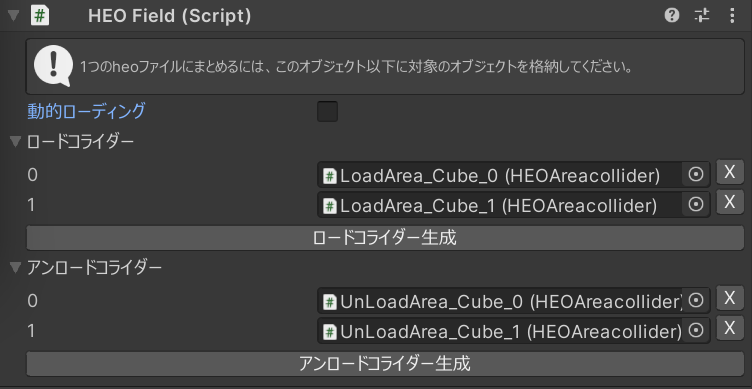

# HEOField

HEOFieldがアタッチされたオブジェクトは、BuildAndRun時に.heoとしてパックされます。.heoファイルに含めたいオブジェクトは、必ずHEOField以下に配置してください。

なお、HEOFieldはシーンに複数配置することができます。

VketCloudにおいてワールドに入った後に特定のエリアへ行くとロードされるオブジェクトの実装も可能です。

## 動的ローディング設定方法
1. ロードされるオブジェクトのHEOFieldのコンポーネントの「動的ローディング」のチェックを外す。
2. ロードコライダーの項目を開き、「ロードコライダー生成」を押してロードに使うエリアコライダーを生成する。
3. 生成されたロード用のコライダーを最初から読み込まれるHEOFieldの子オブジェクトにし、位置や範囲を調整する。

## アンローディングの設定
1. アンロードコライダーの項目を開き、「アンロードコライダー生成」を押してロードに使うエリアコライダーを生成する。
2. 生成されたアンロード用のコライダーをHEOFieldの子オブジェクトにし、位置や範囲を調整する。

## 注意点
設定されたコライダーを外すには項目の右側にあるXボタンを押すことでリストから消すことができますが、オブジェクトは残ったままになるので、そちらは手動で削除が必要になります。