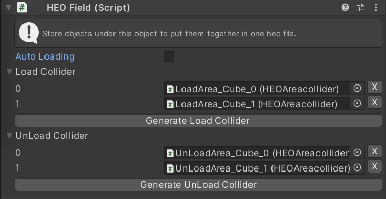

# HEOField

HEOFieldがアタッチされたオブジェクトは、BuildAndRun時に.heoとしてパックされます。.heoファイルに含めたいオブジェクトは、必ずHEOField以下に配置してください。

!!! note info
    HEOFieldはシーンに複数配置することができます。

---

## 動的ローディング設定方法
VketCloudでは、ワールドに入った後に特定のエリアへ侵入した時にオブジェクトをロードさせることができます。これを、「動的ローディング」と呼びます。設定方法は、以下のとおりです。

### ロード発火側
1. ロードされるオブジェクトが持つHEOFieldコンポーネントの「動的ローディング」のチェックを外す。
2. ロードコライダーの項目を開き、「ロードコライダー生成」を押してロードに使うエリアコライダーを生成する。
3. 生成されたロード用のコライダーを最初から読み込まれるHEOFieldの子オブジェクトにし、位置や範囲を調整する。

### アンロード発火側
1. アンロードコライダーの項目を開き、「アンロードコライダー生成」を押してロードに使うエリアコライダーを生成する。
2. 生成されたアンロード用のコライダーをHEOFieldの子オブジェクトにし、位置や範囲を調整する。

!!! note caution
    設定されたコライダーは、各項目の右側にあるXボタンを押すことでリストから消すことができますが、オブジェクトは残ったままになるので、そちらは手動で削除が必要になります。