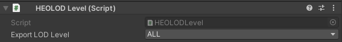

# HEOLODLevel
HEOLODLevel is a function that allows you to switch meshes to be exported as heo without disassembling assets with LOD Groups set.
If LOD0 is set, only objects set to LOD 0 in the LOD Group will be output.

Options for Export LOD Level

| Options |
| ---- |
| LOD0 |
| LOD1 |
| LOD2 |
| LOD3 |
| LOD4 |
| LOD5 |
| LOD6 |
| LOD7 |
| ALL |
| NONE |

## Note
- The default setting is set to "ALL"
- LOD switching is not possible on VketCloud.