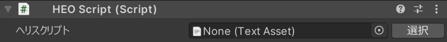

# HEOScript

| ラベル |  機能  |
| ----   | ---- |
| ヘリスクリプト | .hsファイルを指定します。 |

##　注意点
- HEOScriptは、スクリプトの対象となるHEOField以下に配置する必要があります。
- 詳しいHeliScriptの書き方は以下をご覧ください。
- [クラス](../hs/hs_class.ja.md)
- [コンポーネント](../hs/hs_component.ja.md)