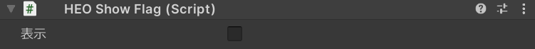

# HEOShowFlag

HEOフィールド上のオブジェクトを表示/非表示にする場合に利用します。

| ラベル | 機能 |
| ---- | ---- |
| `表示` | チェックを外すことで非表示にできます。| 

!!! note info
    - ActionTriggerの[Show/HideNode](../Unity/ShowHideNode.ja.md)でも、動的に表示/非表示にすることができます。
    - 非表示にするのは見た目のみで、コライダーなどの判定は機能します。

