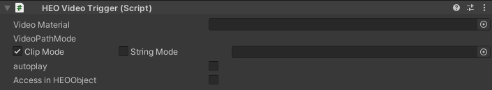

# HEOVideoTrigger

HEOVideoTriggerは動画を再生するために使用します。

| Label | 詳細 |
| ---- | ---- |
| Video Material | 動画を表示するマテリアルを指定します。 |
| VideoPathMode | 動画データの参照方法を指定します。|
| autoplay | 動画を自動で再生するか指定します。|

##注意事項
本コンポーネントだけでは動画ファイルを.heoにパッキングすることができないため、HEOFieldを必ず追加してください。 

autoplayを設定しない場合にはアクション等いずれかの手段で再生開始をコントロールする必要があります。 
画像ではHEOActionTriggerを使用してクリックによる動画再生を実装しています。

##VideoMaterialについて
マテリアルに使用するShaderはUnlit/Textureである必要があります。

##VideoPathModeについて 
ClipModeはプロジェクトの内部にあるデータを参照します。 
StringModeはURLを指定して参照します。動画ストリーミング等に利用できます。

##使用する動画ファイルについて
以下のフォーマットに従ってください。

| Label | 詳細 |
| ---- | ---- |
| 解像度 | 1280x720 H.264|
| AAC | 44.1kHz |
| フレームレート | 29.97 or 30 |
| プロファイルレベル | 4.1, AAC 44.1kHz, yuv420 |