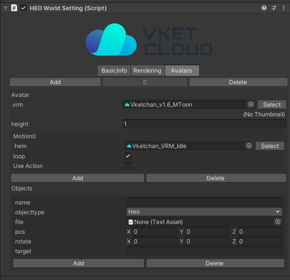

# HEOWorldSetting

HEOWorldSettingはワールドの各種情報を管理します。 
このコンポーネントでは、基本情報、描画設定、アバター設定の3種類を設定することができます。

# Basic Info
|  Label |  function  |
| ----   | ---- |
|  World Name |  ワールド名を設定する項目です。URLなどに反映されます。|
|  Debug Mode  |  デバッグモードを切り替えることができます。オンにするとブラウザ上で`F1`または`F2`からデバッグ機能を使用することが可能になります。|
|  Show Avatar Icon  |  使用しません。  |
|  VRM Drop  |  ブラウザ上へのVRMドロップによる着替えを許可します。 |
|  Occulusion Culling  | 使用しません。  |

# Rendering
|  Label |  function  |
| ----   | ---- |
|  PBR |  PBRライティングをオンにします。|
|  Light Direction  |  デバッグモードを切り替えることができます。オンにするとブラウザ上で`F1`または`F2`からデバッグ機能を使用することが可能になります。|
|  Light Color  |  ワールドのメインライト色を指定します。|
|  Projection Near  |  近傍のクリッピング距離を指定します。 |
|  Projection Far  | 遠方のクリッピング距離を指定します。  |
|  Projection Degree  | 画角を指定します（デフォルト値推奨） |

# Avatars

!!! note info 
    この項目では初期設定で表示するアバターを指定します。 
    アバターリストが空欄の場合、Build And Runに失敗します。

### Avatarブロック
初期設定で表示するVRM形式のアバターを指定する項目です。

|  Label |  function  |
| ----   | ---- |
|  .vrm | アバターに使用するモデルを設定します。 |
|  height  | アバターのカメラ基準位置を設定します。0にすると、足元を中心にカメラが追従します。 |

### Emotionブロック
各ユーザーが使用できるエモーションを設定する項目です。Vket Cloudでは任意のエモーションを追加することができ、`.hem`という独自のファイル形式を採用しています。

|  Label |  function  |
| ----   | ---- |
| .hem | モーションファイルを設定します。 |
| loop | モーションをループ再生します。歩きや待機モーションはオンにしてください。 |
| useAction | モーション再生開始時に呼び出すアクションを設定します。 |

### Objectsブロック
アバターに対して任意のアセットを持たせるための項目です。 
Heo・Hep・Auidoの3つの形式に対応しています。

|  Label |  function  |
| ----   | ---- |
| name | 固有の名前を設定します。 |
| objecttype | 持たせるオブジェクトのタイプを指定します。.heo、.hep、audioが使用できます。 |
| file | アセットを指定します。 |
| pos | targetからのオフセットを設定できます。 |
| rotate | 回転角度を設定できます。 |
| target | 座標基準となるボーンを指定します。ex. right, left, ... |