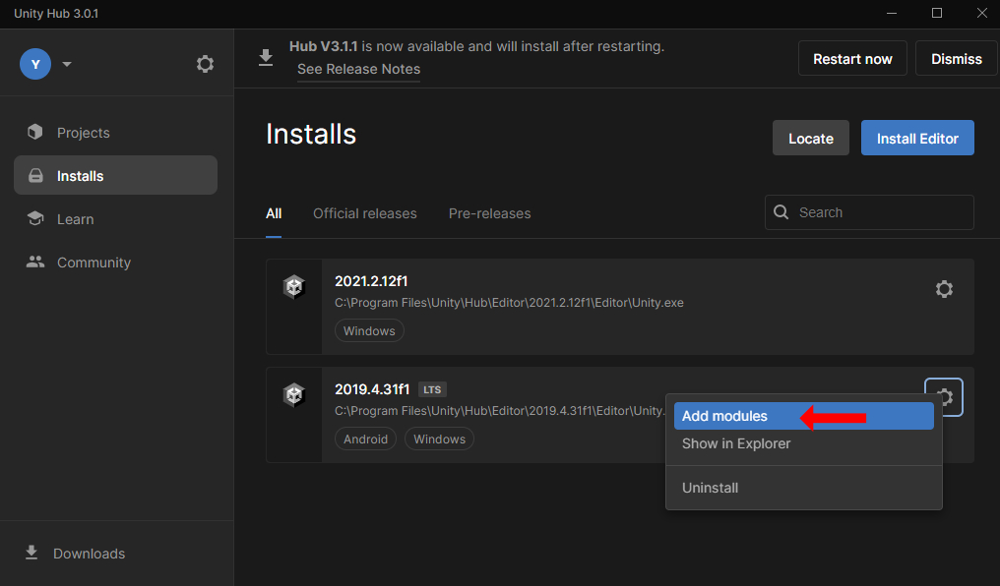

# 動作環境
VketCloudSDKは、以下の環境が必要です。

- **Unity 2019.4.31f1**

該当のUnityをお持ちでない方は、Unityの公式ページ([こちら](https://unity.com/ja))よりダウンロードしてください。

## Unity上での設定
### Android Build Supportモジュールの設定
1. Unityの**Android Build Supportモジュール**をインストールする必要があります。
    
    
2. Build SettingsからPlatfromをAndroidに変更してください 
UnityのメニューバーのFileからBuild Settingsを選択し、Andoroidをクリックしてください
    
3. Androidの項目にUnityのマークが表示されていれば設定されていれば本手順は完了です

### API互換性レベルの変更
1. UnityのメニューバーのEditからProject Settings...をクリックしてください
2. Project Settingsウインドウが表示されたら、一覧からPlayerをクリックしてください
3. PCの設定中にあるConfigurationを確認し、Api Compatibility Levelの項目をプルダウンメニューから「.NET 4.x」に変更してください
    