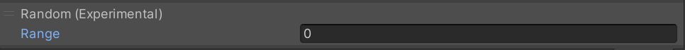

# Random

This feature enables execution of a random action.

This is a process that extracts and executes one Action from the list of Actions between the next Action and the randomly inputted number, without executing the other Actions. By using this, you can execute one random action from multiple actions when clicked.