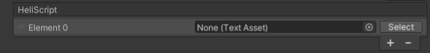
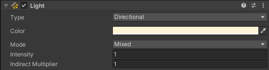
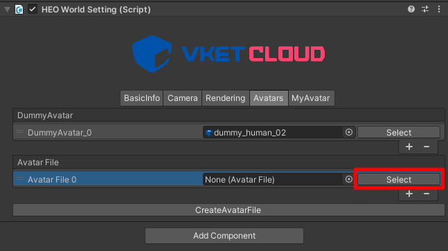
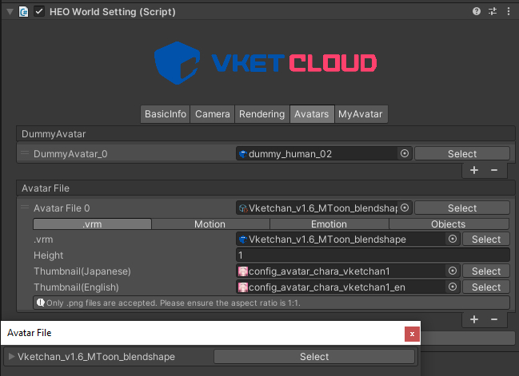
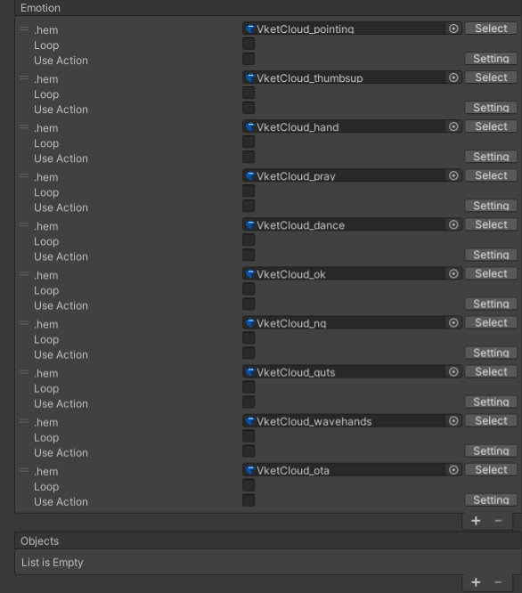

# HEOWorldSetting

!!! note warning
    本コンポーネントはSDK Ver12.0にて廃止されました。 
    新機能として[Vket Cloud Settings](../VketCloudSettings/Overview.md)が追加されたため、そちらをお使いください。

HEOWorldSettingはワールドの基本設定を取りまとめるコンポーネントで、以下の設定を管理しています。

- 基本情報
- カメラ設定
- 描画設定
- アバター設定
- マイアバター設定

---

## 基本設定

!!! note warning
    本コンポーネントはSDK Ver12.0にて廃止されました。 
    新機能として[Vket Cloud Settings](../VketCloudSettings/Overview.md)が追加されたため、そちらをお使いください。

| 名称 | 初期値 | 機能 |
| ---- | ---- | ---- |
|  `World Name` | "world" |  ワールド名を設定する項目です。基本的にはワールド作成時に自動生成されたIDがアップロード時に自動入力され、URLなどに反映されます。  (例：[VketID_of_Creator].cloud.vket.com/worlds/[World_Name])|
|  `Debug Mode` | false |  デバッグモードを切り替えることができます。オンにするとブラウザ上で`F1`または`F2`からデバッグ機能を使用することが可能になります。 詳しくはデバッグモードの[解説ページ](../WorldEditingTips/DebugMode.md)をご確認ください。|
| `Use Avatar Click`| true | 他のプレイヤーをクリックした時に処理を利用するかどうかの設定です。 |
| `VRM Drop` | false | ブラウザ上へのVRMドロップによるローカルの(他プレイヤーから見えない)アバター変更を許可します。 |
| `Occlusion Culling` | false | オクルージョンカリングをオンにします。 詳しい使い方は[オクルージョンカリング](../WorldOptimization/OcclusionCulling.md)をご確認ください。　|
| `World Name Directory` | false | .heoファイルなどの出力時に、ワールド名の付いたフォルダにまとめます。 (例： data/field/`ワールド名`/world.heo)|
| `Use GamePad` | false | ゲームパッドを使用するかどうかの設定です。 |
| `Use Physics Engine` | false | 物理エンジンを使用するかどうかの設定です。|
| `Voice Attenuation` | true | プレイヤー音声の距離減衰の有効/無効を切り替えます。 |
| `Min Distance (m)`| 5.0 | 減衰を開始する距離をメートル単位で指定します。 |
| `Max Distance (m)`| 10.0 | 減衰を終了する距離をメートル単位で指定します。|
| `Favicon` | 空欄 | Faviconを設定する項目です。 |
| `HeliScript` | 空欄 | ワールド内で使用されるHeliScriptが一覧表示されます。[VKC Attribute Script](./VKCAttributeScript.md)などで指定したHeliScriptは本項目にリストアップされます。|

!!! note
    `HeliScript`は基本的には自動で項目が追加されますが、ファイルの削除などによって項目に`None`(未指定)または`Missing`が発生する場合があります。
    HeliScriptの項目内が`None`(未指定)または`Missing`の状態はビルドエラーの原因になるため、ご注意ください。

!!! note
        環境にゲームパッドが接続されている状態で`Use GamePad`が有効になっているワールドに入場すると、ゲームパッドによる操作が可能となります。 
        使用するゲームパッドによって操作方法が異なる場合がありますが、基本的には以下の操作が可能です。 
        なお、キー割り当ての変更/追加、ゲームパッドによるカメラ操作の反転については現バージョンでは非対応です。

| 名称 | 機能 |
|----|----|
| 左スティック | アバター移動 |
| 右スティック | カメラ操作 |
| □ / X / Y　| ジャンプ |
| R3（右スティック押し込み）| カメラリセット（初期方向に戻る）|

---

## カメラ設定

!!! note warning
    本コンポーネントはSDK Ver12.0にて廃止されました。 
    新機能として[Vket Cloud Settings](../VketCloudSettings/Overview.md)が追加されたため、そちらをお使いください。

| 名称 | 初期値 | 機能 |
| ----   | ---- | ---- |
|  `Smoothing` | false | カメラの上下の動きにスムージングをかけるかどうかを指定します。 |
|  `Far Offset (y-axis)` | 0.0 | TPSカメラの注視点を上下に調整できます。 |
|  `Near Offset (y-axis)` | 0.0 | TPSカメラの注視点を上下に調整できます。 |
| `Photo Radius` | 20.0 | 撮影モードカメラの移動可能半径を指定します。|
| `Raycast Max Distance` | 50.0 | クリック判定をおこなうカメラからの最大距離をメートル単位で指定します。 |
| `TPS Pitch Max Angle` | 6.0 | TPSカメラの最大ピッチ角度を指定します。  ワールド内の設定の「アイレベル」にて「高い」を選択すると本設定の値が適用され、「普通」を選択すると半分の値が適用されます。 |
| `Default TPS Camera` | TPS Center | TPSカメラのオフセットを指定できます。  ワールド内設定の三人称視点位置にて切り替えることができます。 `TPS Center`：真後ろ`right`：右肩越し（一般的なTPSカメラ）`left`：左肩越し |

---

## 描画設定

!!! note warning
    本コンポーネントはSDK Ver12.0にて廃止されました。 
    新機能として[Vket Cloud Settings](../VketCloudSettings/Overview.md)が追加されたため、そちらをお使いください。

| 名称 | 初期値 | 機能 |
| ----   | ---- | ---- |
| `PBR` | true |  PBRライティングをオンにします。|
| `Directional Light` | 空欄 | シーンに設置されたディレクショナルライトをワールドライトとして指定します。 |
| `Fade In Time` | 2.0 |　ワールド入場時のホワイトフェードインの時間を秒単位で指定します。|
| `Shadow Type`| Round |　影の描画方法を指定します。`round`は 丸影、`normalshadowmap`は通常のシャドウマップです。 `normalshadowmap`は[VKC Node Shadow](VKCNodeShadow.md)と組み合わせて使用します。|
| `Shadow Bias` | 0.001 |　影描画のバイアス値を設定します。|
| `Shadow Area Size` | 3.0 |　シャドウを描画する距離をメートル単位で指定します。|
| `Shadow Fade Size` | 1.0 |　シャドウ外周に向かってフェードアウトする距離をメートル単位で指定します。　|
| `Projection Near` | 0.1 |  近傍のクリッピング距離を指定します。 |
| `Projection Far` | 500.0 | 遠方のクリッピング距離を指定します。  |
| `Projection Degree` | 70.0 | 画角を指定します。（デフォルト値推奨） |
| `Bloom` | false | ブルームのオンオフを切り替えます。 |
| `Light Scattering` | false | ライトスキャッタリングのオンオフを切り替えます。 |
| `IBL` | false | IBL（Image-Based Lighting）のオンオフを切り替えます。 |

!!! note caution
        `Directional Light`に設定されているIntensityの値（下記画像参照）はワールドに反映されないためご注意ください。 
        ライトの強弱は`LightColor`の色を`Directional Light`側の色と重ね合わせることで表現が可能です。

---

## Bloom / Light Scattering / IBL設定

!!! note warning
    本コンポーネントはSDK Ver12.0にて廃止されました。 
    新機能として[Vket Cloud Settings](../VketCloudSettings/Overview.md)が追加されたため、そちらをお使いください。

|  名称 | 初期値 | 機能 |
| ----   | ---- | ---- |
| `Bloom` | false | ブルームのオンオフを切り替えます。 |
| `Bloom Intensity` | 0.2 | ブルームの強さを設定します。|
| `Bloom Threshold` | 0.8 | ブルームの閾値を設定します。 |
| `Light Scattering` | false | ライトスキャッタリングのオンオフを切り替えます。 |
| `Scattering Intensity` | 0.8 | 空気散乱強度を設定します。 |
| `Scattering Directivity` | 0.68 | 拡散指向性を調整します。 |
| `G` | 0.0 | IBLの強さを調整するパラメータを設定します。 |
| `Distance` | 150.0 |効果開始距離を設定します。 |
| `LightColor` | #FFFFFF | ライトカラーを指定します。 |
| `SunColor` | #D9D9FF | 太陽光色を設定します。 |
| `IBL` | false | IBL（Image-Based Lighting）のオンオフを切り替えます。 |
| `DiffuseSize` | 512 | ディフューズマップのサイズを指定します。 |
| `SpecularSize` | 512 | スペキュラマップのサイズを指定します。 |
| `SpecularMipMapCount` | 6.0 | スペキュラ用キューブマップのミップマップの数を指定します。|

---

## アバター設定

!!! note warning
    本コンポーネントはSDK Ver12.0にて廃止されました。 
    新機能として[Vket Cloud Setting](../VketCloudSettings/Overview.md)が追加されたため、そちらをお使いください。

| 名称 | 初期値 | 機能 |
| ----   | ---- | ---- |
| `Dummy Avatar` | dummy_human_02 | 遠方や描画制限がかかった場合に描画するダミーアバターを指定します。 |
| `Avatar Files` | Vketchan_v1.6_Mtoon_blendshape | アバター情報をまとめたアバターファイルを指定します。アバターファイルについては、[こちら](../WorldMakingGuide/AvatarFile.md)をご覧ください。 |
| `CreateAvatarFile` | | 新規のアバターファイルを生成します。 |

!!! note caution
    HEOWorldSetting > Avatars > Avatar Fileにて空欄がある、Avatar Fileが1つも設定されていない場合はビルドエラーが発生したり初期状態のアバターが表示されない状態となります。

SDKでは初期状態のアバターとして用意しているAvatarFileがあるため、バージョンアップ後に空欄が発生している際はこちらをご利用ください。

---

## マイアバター設定

!!! note warning
    本コンポーネントはSDK Ver12.0にて廃止されました。 
    新機能として[Vket Cloud Setting](../VketCloudSettings/Overview.md)が追加されたため、そちらをお使いください。

| 名称 | 初期値 | 機能 |
| ----   | ---- | ---- |
| `Use MyAvatar` | true | プレイヤーがマイアバターを使用できるか否か設定します。 |
| `NSFW` | false | NSFW（Not Safe For Work: 閲覧注意）なアバターの表示を制限します。|
| `Polygon` | 50000 | そのワールド内で使用できるマイアバターのポリゴン上限を指定します。 |
| `Motion` | | マイアバターが使用するモーションを指定します。|

---

### Motion設定

| 名称 | 初期値 | 機能 |
| ----   | ---- | ---- |
| `Motion Name` | | モーション名を設定します。 |
| `.hem` | | モーション再生時に使用するアニメーションファイル(.hem)を指定します。 |
| `loop` | true | アニメーションをループ再生するか設定します。 |
| `Use Action` | false | モーション再生時に実行するアクションを設定します。  具体的には、本項目を有効にした上で`Setting`から実行するアクションを設定します。 `.hem`が空欄のモーションを追加することで、モーション再生時にパーティクルだけ再生する、といった用途等に利用できます。 |
| `Draw Circle Shadow` | true | モーション再生時に丸影を描画するかどうか設定します。 |
| `Collision Detection` | true | モーション再生時に衝突判定をおこなうかどうか設定します。 |

### モーションについて

デフォルトで設定されているアニメーション及びモーション名はSDK側で使用しているモーションです。 
[アニメーションファイルを用意し差し替える](../HEMAnimationConverter/AnimationConverter.md)ことで待機・歩行などのマイアバターのアニメーションを差し替えることができます。 
ワールドにて用意したプリセットアバターのアニメーションを設定するにはアバター設定にて指定した[アバターファイル](../WorldMakingGuide/AvatarFile.md)を編集します。

---
### Emotion設定

| 名称 | 初期値 | 機能 |
| ----   | ---- | ---- |
| `Emotion` || マイアバターが使用するエモートを指定します。|
| `loop` | true | アニメーションをループ再生するか設定します。 |
| `Use Action` | false | エモーション再生時に実行するアクションを設定します。  具体的には、本項目を有効にした上で`Setting`から実行するアクションを設定します。|

---

### Objects設定

マイアバターにオブジェクト（.heoファイル、パーティクル、音声）を指定します。 
3Dモデルを設定したい場合は [.heoファイルへの変換](../WorldMakingGuide/HEOExporter_Tutorial.md)が必要です。

| 名称 | 初期値 | 機能 |
| ----   | ---- | ---- |
| `Name` | 空欄 | オブジェクトの名前を設定します。 |
| `Object Type` | Heo | オブジェクトの種類を設定します。 `Heo`: [.heoファイル](../WorldMakingGuide/HEOExporter_Tutorial.md), `Hep`: パーティクル,`Audio`: 音声 |
| `File` | 空欄 | 使用するファイルを指定します。 |
| `Position`| 0,0,0 | Targetからの相対座標を指定します。 |
| `Rotation` | 0,0,0 | Targetからの相対角度を指定します。 | 
| `Target` | 空欄 | Position及びRotationの基準となるボーン名を指定します。 ボーン名は[VRMヒューマノイド](https://vrm.dev/univrm/humanoid/humanoid_overview){target=_blank}のフォーマットに由来しており、記載する際はスネークケースにします(例： head, leftLowerLeg, leftThumbProximal...) |
