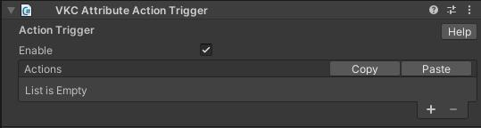

# VKC Attribute Action Trigger

VKC Attribute Action Trigger is a component for introducing actions to the object.  
It executes the specified actions when a collider is clicked.

To attach a VKC Attribute Action Trigger, a Collider must be attached to the object.

You can set any action by clicking "+" button.  
You can remove the last action by clicking "-" button.

For actions, see [Actions Overview](../Actions/ActionsOverview.md).  
For colliders, see [Unity Production Guidelines - Colliders](../WorldMakingGuide/UnityGuidelines.md).