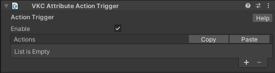

# VKC Attribute Action Trigger

VKC Attribute Action Triggerは、オブジェクトに対してアクションを導入することができるコンポーネントです。 
コライダーをクリックした際にアクションを実行します。

VKC Attribute Action TriggerをアタッチするオブジェクトにはColliderがアタッチされている必要があります。 
また、クリック判定を有効にするためには、[VKC Node Collider](VKCNodeCollider.md)コンポーネントのCollider Typeを**「Clickable(クリック対象)」**に設定する必要があります。

!!! note
    VKC Node ColliderはローカルビルドのタイミングでColliderを持つオブジェクトに自動的に付与されますが、既に付いている場合は追加されません。 
    VKC Node Colliderがまだアタッチされていない場合は手動で追加し、既にアタッチされている場合はCollider Typeの設定を確認・変更してください。

「+」をクリックすることで任意のアクションを設定できます。 
「-」をクリックすることで最後尾のアクションを削除できます。

アクションについては[アクションの概要](../Actions/ActionsOverview.md)を参照してください。 
コライダーについては[Unity制作ガイドライン - コライダー](../WorldMakingGuide/UnityGuidelines.md)を参照してください。