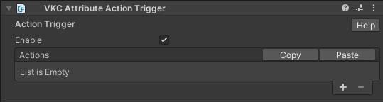

# VKC Attribute Action Trigger

VKC Attribute Action Triggerは、オブジェクトに対してアクションを導入することができるコンポーネントです。 
コライダーをクリックした際にアクションを実行します。

VKC Attribute Action TriggerをアタッチするオブジェクトにはColliderがアタッチされている必要があります。

「+」をクリックすることで任意のアクションを設定できます。 
「-」をクリックすることで最後尾のアクションを削除できます。

アクションについては[アクションの概要](../Actions/ActionsOverview.md)を参照してください。 
コライダーについては[Unity制作ガイドライン - コライダー](../WorldMakingGuide/UnityGuidelines.md)を参照してください。