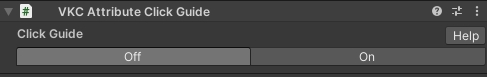
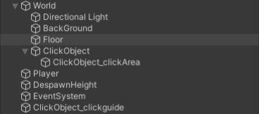
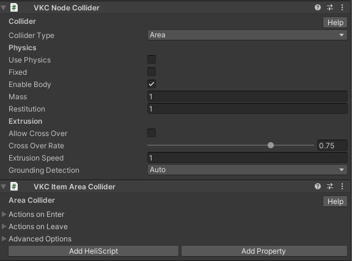
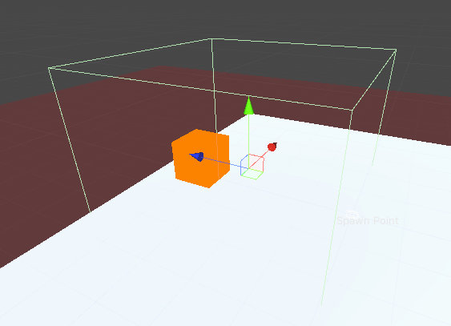
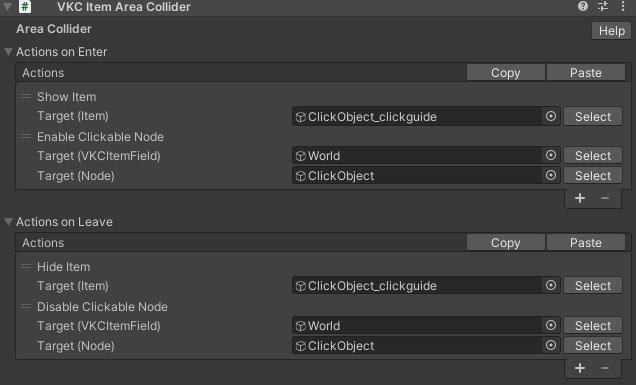
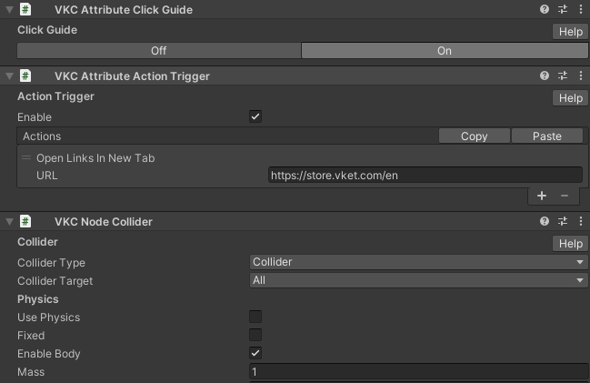
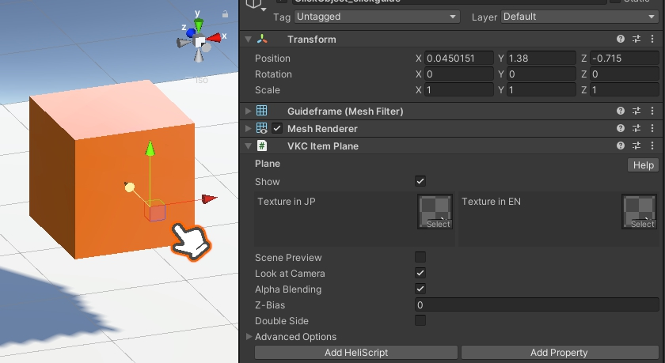
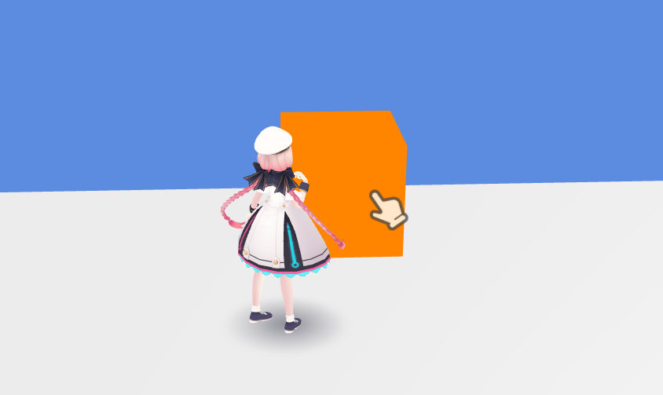
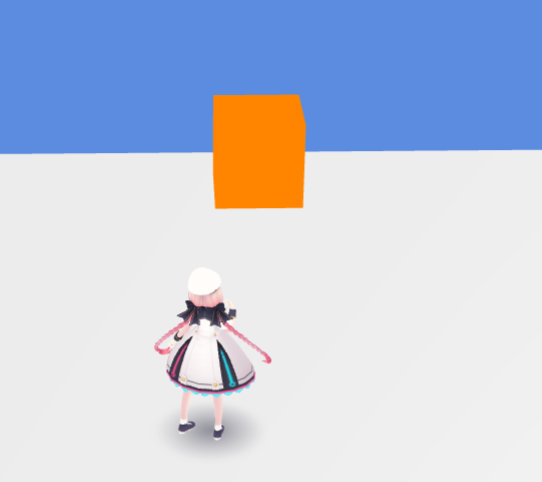

# VKC Attribute Click Guide

コンポーネントの`ON`を選択すると、一定のエリア内に入るとクリックガイドを出現させるためのオブジェクト類を生成します。 
`OFF`を選択すると、生成されたオブジェクトは**削除**されます。

## 使い方

`VKC Attribute Click Guide`を押した際、`VKC Attribute Click Guide`がアタッチされたオブジェクトの子に`[オブジェクト名_clickArea]`(以下、`clickArea`)が生成されます。 
また、`World`オブジェクトの外に`[オブジェクト名_clickguide]`(以下、`clickguide`)が生成されます。

`clickArea`では`clickGuide`の表示/非表示を[VKC Item Area Collider](./VKCItemAreaCollider.md)及び[Show/HideItem](../Actions/Item/ShowHideItem.md)を使用して切りかえています。 

生成時の初期状態では`clickArea`はデフォルトのキューブと同一のサイズです。 
下記画像のように、ガイドを表示させたい範囲に応じて`clickArea`のサイズ調整を行うことをおすすめします。

`clickArea`では[Enable/DisableClickableNode](../Actions/Node/EnableDisableClickableNode.md)を使用して元オブジェクトのクリック判定のオンオフを切り替えることができます。

生成元のオブジェクトでは、例として[OpenWeb](../Actions/Web/Openweb.md)及び[VKC Node Collider](./VKCNodeCollider.md)にて`Clickable`を設定することで、クリックガイドが表示されている際にのみウェブページを開くギミックが実装できます。

`clickguide`にはクリックガイド用の画像を表示するための[VKC Item Plane](./VKCItemPlane.md)があります。 
初期状態では`Billboard`及び`Show`が無効となっているため、有効に切り替えることをおすすめします。

ビルドした際のクリックガイドの見た目は以下の通りです。

`clickArea`内にいて、クリックガイドが表示されている状態：

`clickArea`外にいて、クリックガイドが非表示の状態：

