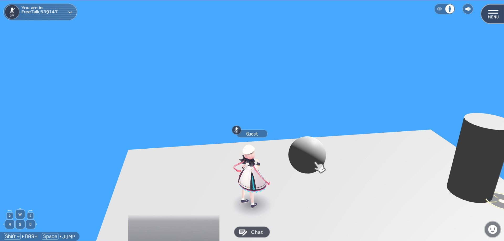

# VKCAttributeClickableUI

VKCAttributeClickableUI component contains a feature to setup a guide UI indicating a "clickable" object in the world. 

!!! note "About VKCAttributeClickGuide (old: HEOClickGuide)"
    This component is intended to simplify and generalize the VKCAttributeClickGuide (old: HEOClickGuide) component. 
    As VKCAttributeClickGuide is scheduled to be deprecated in future versions, please use this component instead.

## Basic Settings

### Single Image

| Label | Initial Value | Feature |
|----|----|----|
| Look At Camera | true | When true, the Guideframe image will always face the camera |
| Alpha Blending | true | Toggles transparent and cut-out rendering |
| Double Side | true | Toggles double-side rendering  |
| Foreground Rendering | true | Toggles rendering on the frontmost layer |
| Follow Nodes | true | Toggles UI following if node is dynamic |
| Auto Hide | true | Toggles automatic hide after the player enters the area |
| Time for Hiding(s) | 5.0 | Display time of UI after player entry |
| Single Image/Animation |  Single Image | Designates display mode as a static png image, or animation image played frame-by-frame |
| Image(.png) | .guideframe | Designate an image for Guideframe |
| Position |  [0.0, 0.0, 0.0] | Designates relative Position from the Transform component in the same GameObject |
| Rotation |  [0.0, 0.0, 0.0] |Designates relative Rotation from the Transform component in the same GameObject |
| Scale | [1.0, 1.0, 1.0] | Designates Scale |

### Animation

| Label | Initial Value | Feature |
|----|----|----|
| Animation Speed | 1.0 | Designates frame speed. If value is 1, 1 frame will advance per second. |
| Frames For Animation |- | Designates a frame list for animation. Frame will be played from the top. |
| Image(.png) | .guideframe | Designate an image for Guideframe |
| Position |  [0.0, 0.0, 0.0] | Designates relative Position from the Transform component in the same GameObject |
| Rotation |  [0.0, 0.0, 0.0] |Designates relative Rotation from the Transform component in the same GameObject |
| Scale | [1.0, 1.0, 1.0] | Designates Scale |

## How to Use

1. Attach VKCAttributeClickableUI component to an empty GameObject. 
    When component is attached, [VKCNodeCollider](../../HEOComponents/HEOCollider.md), BoxCollider, and [VKCItemAreaCollider](../../HEOComponents/HEOAreacollider.md) will be attached automatically as well.

    

1. When the player enters the BoxCollider area, the guide UI indicating a clickable object will be shown. 
    Adjust the BoxCollider Scale depending on the intended distance for the object to be clickable.

    

1. Designate the object to be clicked on [VKCItemAreaCollider](../../HEOComponents/HEOAreacollider.md)'s OnEnter / OnExit, which can be used to control the object's clickable status. 
    For example, the Sphere object is controlled in the areacollider using [Enable / DisableClickableNode](../../Actions/Node/EnableDisableClickableNode.ja.md) actions.

    

1. Build the world to check the appearance. 
    When the player enters the Box Collider, the guide UI for showing the object's clickable status will be shown, and the target object becomes clickable as well. 
    When the component is in Single Image mode, the displayed image will be shown by the time length designated on Time for Hiding(s). 
    If the guide UI should be always shown while the player is in the Box Collider, disable Auto Hide.

    

1. If the UI should be emphasized, the Animation mode can be used! 
    For example, an animation changing the scale per frame as `1.0 → 1.2 → 1.5 → 1.2 → 1.0` is implemented, which animation speed is set to 5.0. 
    Additionally, Auto Hide is disabled to prevent the guide UI from disappearing.

    

1. Build the world to see the guide UI's scale change animation.

    

!!! tip "Implementing complex animations"
    The Animation mode is intended to be used for frame-by-frame animations. 
    If complex animations and effects is needed, further implementation can be done by following setup instructions on [How to Animate Objects / How to add animation to HEOObject](../../WorldMakingGuide/PropAnimation.md#how-to-add-animation-to-heoobject), and setup connection between [VKCItemObject](../../HEOComponents/HEOObject.md) and [VKCItemAreaCollider](../../HEOComponents/HEOAreacollider.md).
