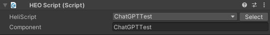

# VKC Attribute Script

|  Label |  function  |
| ----   | ---- |
| HeliScript | Specify the `HeliScript` file to run from the list located in [HEOWorldSetting](../HEOComponents/HEOWorldSetting.md)'s `BasicInfo/HeliScript`.  If the `HeliScript` file to run doesn't appear, add the file to [HEOWorldSetting](../HEOComponents/HEOWorldSetting.md) via `Select`.|
| Component | Designate the component to be used from the specified `HeliScript` file. |

## Cautions:
- VKC Attribute Script components are attachable to the GameObject with the [VKC Item Field](./HEOField.md) component, or its child objects (See image below for reference)
- For details on writing HeliScript, refer to the pages below:
- [Class](../hs/hs_class.md)
- [Components / Callback functions](../hs/hs_component.md)

!!! note
    When creating a new `HeliScript` file, the file may not appear on the `HeliScript` list in `VKC Attribute Script`, due to partial file name duplications, etc.
    The issue can be solved by deleting the `VKC Attribute Script` component and re-attaching it to the gameobject.