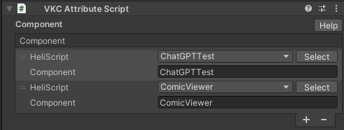

# VKC Attribute Script

| ラベル |  機能  |
| ----   | ---- |
| `HeliScript` | [HEOWorldSetting](../VKCComponents/HEOWorldSetting.md)内の`BasicInfo/HeliScript`リストから実行したい`HeliScript`ファイルを指定します。 実行したい`HeliScript`ファイルがない場合は`選択`ボタンから[HEOWorldSetting](../VKCComponents/HEOWorldSetting.md)に追加します。|
| `Component` | `HeliScript`で選択した`HeliScript`ファイルの使用したいコンポーネント名を指定します。 |

##　注意点
- VKC Attribute Scriptをアタッチ可能なGameObjectは、スクリプトの対象となる[VKC Item Field](./VKCItemField.md)がアタッチされているオブジェクト及びその子オブジェクトです (下記画像を参照)
- 詳しいHeliScriptの書き方は以下をご覧ください。
- [クラス](../hs/hs_class.md)
- [コンポーネント / コールバック関数](../hs/hs_component.md)

!!! note
    `HeliScript`ファイルを新規作成した際、ファイル名の一部重複などの原因によって`VKC Attribute Script`の一覧に表示されない場合があります。
    その際は`VKC Attribute Script`コンポーネントを一度削除し、再度ゲームオブジェクトにアタッチすることで解消されます。