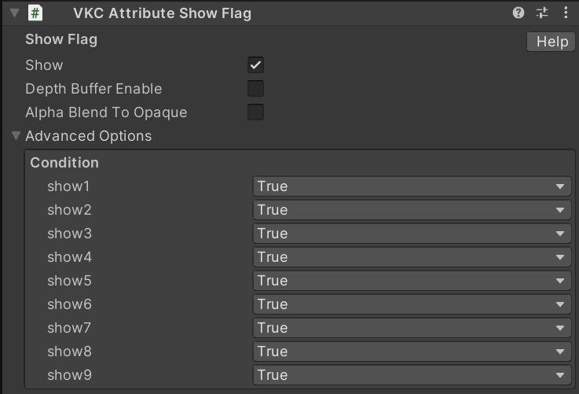
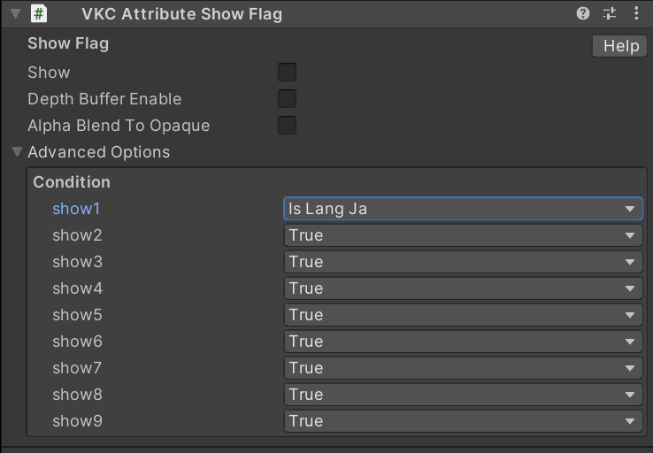

# VKC Attribute Show Flag

The component can be used to display or hide an object on VKC Item Field.

| Label | Default | Function |
| ---- | ---- | ---- |
| Show | True | Can be hidden by unchecking this option.|
| Depth Buffer Enable | False | Specifies whether to write to the depth buffer. |
| Alpha Blend To Opaque | False | Forces alpha-blended rendering to be done in the opaque rendering pass. |

!!! info "Note"
    - The object can be shown by using ActionTrigger's [Show/HideNode](../Actions/Node/ShowHideNode.md) or other methods.
    - The component only hides its appearance. Colliders and other functions remain effective.

## Advanced Options

| Label | Default | Function |
| ---- | ---- | ---- |
| show1 - show9 | True | Toggles the display flag settings. |

## Show Condition Types

The display flags are internally arranged as an array, and can be set individually from show1 to show9.
The default value for all flags is True, and if even one flag in the array is False, it is evaluated as False.

| Type | Description |
| ---- | ---- |
| True | Always returns True. |
| False | Always returns False. |
| Is Lang Ja | Whether the language setting is Japanese. |
| Is Not Lang Ja | Whether the language setting is not Japanese. |
| Is Logined | Whether the user is logged in. |
| Is Not Logined | Whether the user is not logged in. |

For example, set it as below:

In this case, if `Show` becomes True from other operations such as HeliScript, and `Is Lang Ja` is True, then the overall result is considered True, and the item will be displayed.
