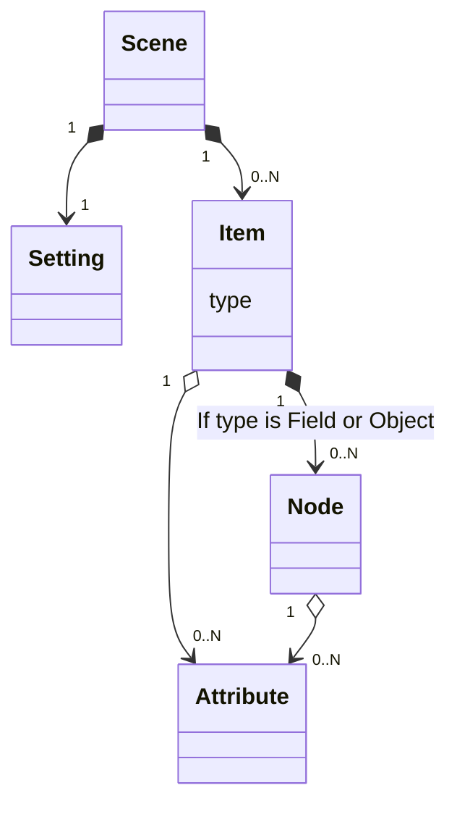

# VKC/HEO Components Overview

The VketCloudSDK includes the following types of components:

- **Setting Component**: Components that can only be assigned one value per scene.
- **Item Component**: Components that can be assigned multiple values within a scene.
- **Node Component**: Components related to nodes.
- **Attribute Component**: Components that assign attributes to items, nodes, objects, etc.
- **Legacy Component (Deprecated)**: Components from older versions.

## Setting Components

| Category | Component Name (-SDK9.X) | Component Name (SDK10.X-SDK12.3) | Component Name (SDK13.X-) |
|------------|--------------------------|----------------------------------|---------------------------|
| Basic     | HEO World Settings         | Base Setting                        | VKC Setting Base            |
| Player    | HEO Player                 | Player Setting                      | VKC Setting Player          |
| DespawnHeight    | HEO Despawn Height                 | Despawn Height Setting                      | VKC Setting Despawn Height          |
| Rendering | HEO Rendering              | Rendering Setting                       | VKC Setting Rendering       |
| Camera    | HEO World Settings         | World Camera Setting                | VKC Setting World Camera    |
| Avatars   | HEO World Settings         | Avatar Setting                      | VKC Setting Avatar          |
| My Avatar | HEO World Settings         | My Avatar Setting                   | VKC Setting My Avatar       |
| Spawn     | HEO Spawn                  | HEO Spawn                           | VKC Setting Spawn           |
| Nameplate | HEO Nameplate              | HEO Nameplate                       | VKC Setting Nameplate       |

## Item Components

| Item Component    | Component Name (-SDK12.3) | Component Name (SDK13.X-) |
|--------------|---------------------------|----------------------------|
| Field        | HEO Field                 | VKC Item Field             |
| Object       | HEO Object                | VKC Item Object            |
| Plane        | HEO Plane                 | VKC Item Plane             |
| Text Plane   | HEO Text Plane            | VKC Item Text Plane         |
| Audio        | HEO Audio                 | VKC Item Audio             |
| Particle     | HEO Particle              | VKC Item Particle          |
| Spot         | HEO Spot                  | VKC Item Spot              |
| Area Collider | HEO Area Collider         | VKC Item Area Collider     |
| Bg. Texture   | HEO Background Texture    | VKC Item Background Texture |
| Activity     | HEO Activity              | VKC Item Activity          |
| Camera       | HEO Camera                | VKC Item Camera            |

## Node Components

| Node Component           | Component Name (-SDK12.3) | Component Name (SDK13.X-)        |
|---------------------|---------------------------|----------------------------------|
| Alpha Animation     | -                         | VKC Node Alpha Animation         |
| Animation           | HEO Animation             | VKC Node Rotate Animation        |
| Rotate Animation    | HEO Rotate Animation      | Deprecated (merged with VKC Node Rotate Animation) |
| Collider            | HEO Collider              | VKC Node Collider                |
| Cylinder Collider   | HEO Cylinder Collider     | VKC Node Cylinder Collider       |
| IBLCubeMap          | -                         | -                                |
| Info                | HEO Info                  | VKC Node Blend Shape Translator  |
| LOD Level           | HEO LOD Level             | VKC Node LOD Level               |
| Mesh Collider       | HEO Mesh Collider         | VKC Node Mesh Collider           |
| Mirror              | HEO Mirror                | VKC Node Mirror                  |
| Reflection Probe    | -                         | -                                |
| Object Type         | HEO Object Type           | VKC Node Reflection Probe Type   |
| Shadow              | HEO Shadow                | VKC Node Shadow                  |
| UV Scroll           | HEO UV Scroller           | VKC Node UV Scroller             |
| Video               | HEO Video Trigger         | VKC Node Video Trigger           |

## Attribute Components

| Attribute Component | Component Name (-SDK12.3) | Component Name (SDK13.X-)       |
|----------------|---------------------------|---------------------------------|
| Action Trigger | HEO Action Trigger        | VKC Attribute Action Trigger    |
| Property       | HEO Property              | VKC Attribute Property          |
| Script         | HEO Script                | VKC Attribute Script            |
| Show Flag      | HEO Show Flag             | VKC Attribute Show Flag         |
| Clickable UI   | -                         | VKC Attribute Clickable UI      |
| Clickguide     | HEO Clickguide            | VKC Attribute Click Guide       |

## Legacy Items

- HEO World Setting
- HEO Despawn Height
- HEO Player
- HEO Redire
- HEO Selecting Object
- HEO Text Preview
