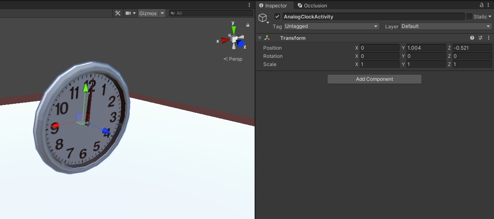
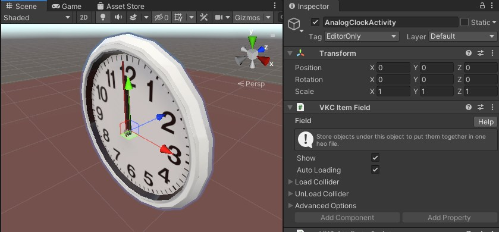
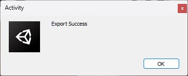

# VKC Item Activity

VKC Item Activityはアクティビティを使用する際に設定するコンポーネントです。 
アクティビティとはモデル・スクリプトをひとまとめの[Item](../hs/hs_overview.md#item)として統合し、ワールドへの配置と設定を便利にするための機能です。

## 設定項目

| 名称 | 機能 |
| ---- | ---- |
| Scene Preview | 設定されたアクティビティをシーン内で表示します。|
| .json | アクティビティの情報をまとめたjsonファイルを指定します。|
| Overrides | 各アクティビティに定義されている設定項目を編集します。 |

!!! caution "Scene Previewについて"
    `Scene Preview`を有効にすると、Scene内でアクティビティのプレビュー用オブジェクトが表示され、このオブジェクトの座標・大きさ・角度などを編集することができます。 
    この操作による変更はビルド時には**元に戻り**、VKC Item Activityが付いているオブジェクトのTransform値が参照されるためご注意ください。

### 高度な設定

| 名称 | 機能 |
| ---- | ---- |
| Clickable | クリック可能かどうかを変更します |
| Auto Loading | 有効の場合、本Itemはワールド入場時に自動で読み込まれます。 無効の場合は自動で読み込まれないため、[動的ローディング](VKCItemField.md)を使用するか、HeliScriptで[Load()](../hs/hs_class_item.md#load)を使用して読み込みます。|
| Item Render Priority | Itemの描画順序を決定します。 詳細は[RenderingSettings / Priority List](../VketCloudSettings/RenderingSettings.md)をご参照ください。 |
| Show Photo Mode | 写真撮影モードの際、Activityを表示するかどうかを変更します |

!!! info "アクティビティの自作について"
    SDK Ver12.x以降では、自分のアクティビティを制作して他の人に共有できるように出力する機能が追加されました。 
    詳細は[VKC Activity Exporter](../SDKTools/VKCActivityExporter.md)をご覧ください。

### Edit Modeについて

Edit ModeはエクスポートされたActivityファイルをUnityEditorで再編集できる機能です。  
Edit ModeのON状態になるとActivityに関連するHeliScriptとMotionのリストを表示し、編集が可能になります。

Edit ModeがOn状態のときScene PreviewはOnに固定され、チェックボックスは非表示になります。

#### Activity編集の方法

ここではAnalogClockActivityを例に編集の方法を解説します。

- 画像の「Activity」オブジェクトはVKC Item Activityスクリプトをアタッチしているオブジェクトです。
- Activity直下のAnalogClockObjectは可視化するオブジェクトのルートです。
オブジェクトの追加、削除、変更をする場合、PreviewObjectRootの下層のオブジェクトのみに適用されます。

可視化オブジェクトは、シーンビューからTransfrom等の調整が可能です。

インスペクタービューでVKC Item ActivityのEdit ModeのOffボタンをクリックすると、編集したActivity内容を自動的に保存されます。

保存成功の場合は以下のダイアログを表示します。

---

## アクティビティの入手方法について

Vket Cloudのアクティビティはアセットストアにて入手が可能です。 

アセットストアは[Vket Cloudマイページ](https://cloud.vket.com/){target=_blank}にログイン後、画面上部のタブにおける「アセットストア」からアクセスが可能です。

アセットストアのアクセス方法、使い方の詳細は以下のマニュアルページをご確認ください。
[便利機能をお手軽にインストール！Vket Cloudアセットストア・アクティビティの使い方](https://magazine.vket.com/n/n7d554dbeb552){target=_blank}

## 設定方法

例として、ここではアセットストアにて入手したアナログ時計アクティビティを使用します。 
アクティビティの入手方法は後述のマニュアルをご確認ください。

1\. ダウンロードしたActivityファイルを解凍します。OSごとに方法が異なりますが、お好みの方法で解凍してください。

2\. ファイル内容を確認し、必ずREADMEをご確認ください。

3\. 以下READMEの内容を確認し、どのパラメーターがカスタマイズできるのかを事前に「アクティビティ設定」項目でご確認ください。

4\. 解凍したanalogclockフォルダーをVketCloudSDKがインストールされているUnityのProjectのアセット内任意のパスに配置してください。

5\. 空のシーンを作成し、シーンにて右クリックした上で "Add Essential Objects for Vket Cloud"を選択して必須コンポーネントを配置します。 その後、アクティビティの配置のために空のオブジェクトを作成します。

6\. 作成した空のオブジェクトの名前を`AnalogClock`などに変更します。（他オブジェクトとは別の名称にしてください。）

7\. VKC Item ActivityコンポーネントをAnalogClockオブジェクトにアタッチします。

8\. activity\analogclock\AnalogClockActivity.jsonをVKC Item Activityのjson項目にセットします。

9\. VKC Item Activityのoverridesで"useSecondHand"の設定をします。パラメーターの説明に関してはREADME.mdの「アクティビティ設定」項目を参照して下さい。

10\. オブジェクトの原点にアナログ時計が出現するので、設置場所をTransformで調整します。

11\. ビルドしてアナログ時計が出現していれば完了です。

