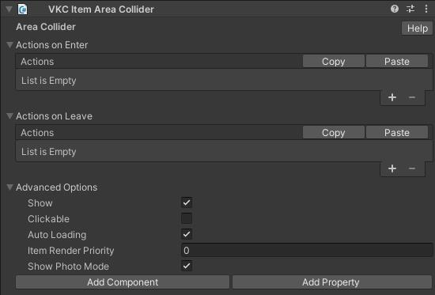
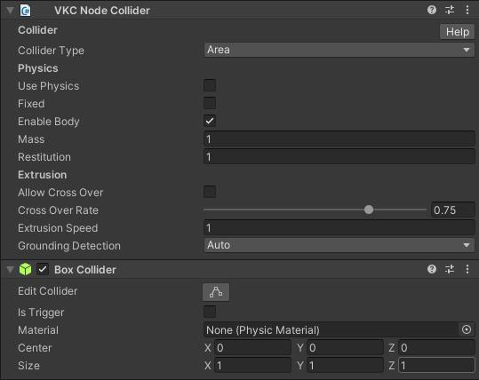

# VKC Item Area Collider

VKC Item Area Collider is a component for introducing actions to objects.  
It executes the specified actions when a player enters the collider.

To attach VKC Item Area Collider, [VKC Node Collider](./VKCNodeCollider.md) and Collider must be attached to the object. 
On attaching a VKC Item Area Collider component to an object, the [VKC Node Collider](./VKCNodeCollider.md) and Box Collider will be added. 
The [VKC Node Collider](./VKCNodeCollider.md) type must be set to Area.

In each of `Actions on Enter` and `Actions on Leave`, you can set any action by clicking Add(+).  
You can remove the last action by clicking Delete(-).

| Label | Function |
| ---- | ---- |
| Actions on Enter | Set the action when entering the area. |
| Actions on Leave | Sets the action when leaving the area. |

For actions, see [Actions Overview](../Actions/ActionsOverview.md).  
For colliders, see [Unity Production Guidelines - Colliders](../WorldMakingGuide/UnityGuidelines.md).

## Advanced Options

| Label | Default | Function |
| ---- | ---- | ---- |
| Show | True | This option does not work with the VKC Item Area Collider. |
| Clickable | False | This option does not work with the VKC Item Area Collider. |
| Auto Loading | True | Toggles dynamic loading on/off. |
| Item Render Priority | 0 | Allows changing the rendering priority of the item in the world. |
| Show Photo Mode | True | This option does not work with the VKC Item Area Collider. |

## About collision / area range detection by collider

The collision / area range detection by collider will be done by obtaining the player's lower body position as the orange circle shown below. 
Collision visualization can be toggled by enabling the [debug mode](../WorldEditingTips/DebugMode.md#f3-display-collision) on [VketCloudSettings / BasicSettings](../VketCloudSettings/BasicSettings.md) and pressing F3.

