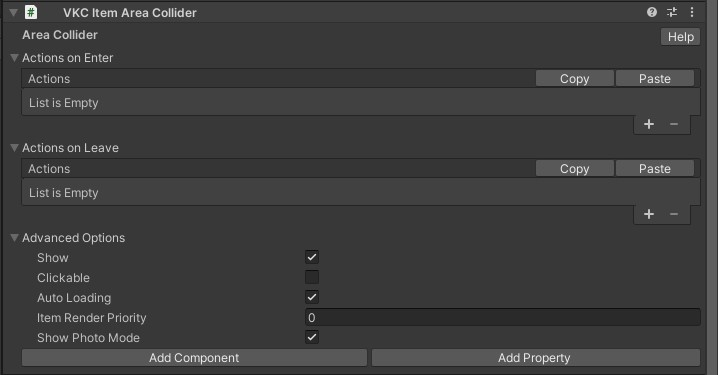

# VKC Item Area Collider

VKC Item Area Collider is a component for introducing actions to objects.  
It executes the specified actions when a player enters the collider.

To attach VKC Item Area Collider, [VKC Node Collider](./VKCNodeCollider.md) and Collider must be attached to the object. 
On attaching a VKC Item Area Collider component to an object, the [VKC Node Collider](./VKCNodeCollider.md) and Box Collider will be added. 
The [VKC Node Collider](./VKCNodeCollider.md) type must be set to Area.

In each of Actions and LeaveActions, you can set any action by clicking +.  
You can remove the selecting action by clicking -.

| Label | Function |
| ---- | ---- |
| Actions | Set the action when entering the area. |
| LeaveActions | Sets the action when leaving the area. |

For actions, see [Actions Overview](../Actions/ActionsOverview.md).  
For colliders, see [Unity Production Guidelines - Colliders](../WorldMakingGuide/UnityGuidelines.md).

## About collision / area range detection by collider

The collision / area range detection by collider will be done by obtaining the player's lower body position as the orange circle shown below. 
Collision visualization can be toggled by enabling the [debug mode](../WorldEditingTips/DebugMode.md#f3-display-collision) on [VketCloudSettings / BasicSettings](../VketCloudSettings/BasicSettings.md) and pressing F3.

### Advanced Settings

| Label | Function |
| ---- | ---- |
| Show | Toggles to change whether to display or not. |
| Clickable | Toggles acceptance of click input from player |
| Auto Loading | When enabled, this Item will be loaded automatically on world entrance.  As this Item must be explicitly loaded when `Auto Loading` is disabled, use [Dynamic Loading](VKCItemField.md) or use [Load()](../hs/hs_class_item.md#load) on HeliScript. |
| Item Render Priority | Designates the Item's render priority.   For details, refer to [RenderingSettings / Priority List](../VketCloudSettings/RenderingSettings.md) |
| Show Photo Mode | Toggles display/hide when in photo mode |

