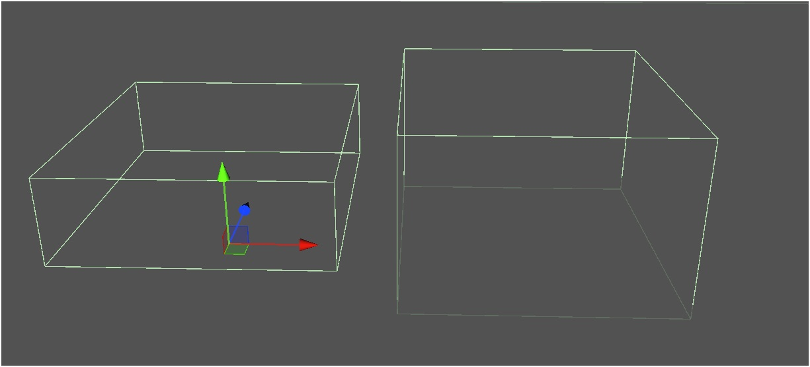

# VKC Item Area Collider

VKC Item Area Colliderは、オブジェクトに対してアクションを導入することができるコンポーネントです。 
コライダーにプレイヤーが進入した際にアクションを実行します。

VKC Item Area Colliderをアタッチするオブジェクトには[VKC Node Collider](./VKCNodeCollider.md)とColliderがアタッチされている必要があります。 
なお、VKC Item Area Colliderをオブジェクトにアタッチすると[VKC Node Collider](./VKCNodeCollider.md)とBox Colliderが自動で追加されます。 
[VKC Node Collider](./VKCNodeCollider.md)のtypeはAreaに設定されている必要があります。

`Actions on Enter`, `Actions on Leave`それぞれにおいてAdd(+ボタン)をクリックすることで任意のアクションを設定できます。 
反対に、Delete(-ボタン)をクリックすることで最後尾のアクションを削除できます。

|  Label |  function  |
| ----   | ---- |
| Actions on Enter | エリア進入時のアクションを設定します。 |
| Actions on Leave | エリア退出時のアクションを設定します。 |

アクションについては[アクションの概要](../Actions/ActionsOverview.md)を参照してください。 
コライダーについては[Unity制作ガイドライン - コライダー](../WorldMakingGuide/UnityGuidelines.md)を参照してください。

## 詳細設定

| 名称 | 初期値 |  説明  |
| ---- | ---- | ---- |
| Show | True | VKC Item Area Colliderでは動作しません。 |
| Clickable | False | VKC Item Area Colliderでは動作しません。 |
| Auto Loading | True | 動的ローディングの有効/無効を切り替えます。 |
| Item Render Priority | 0 | ワールド内のItemの描画優先度を変更できます。 |
| Show Photo Mode | True | VKC Item Area Colliderでは動作しません。 |

## コライダーの衝突 / エリア範囲判定について

ワールド内でのコライダーの衝突 / エリア範囲判定は画像オレンジ円のようにプレイヤーの下半身にて判定されます。 
また、以下のようなコリジョンの可視化は[VketCloudSettings / BasicSettings](../VketCloudSettings/BasicSettings.md)から[デバッグモード](../WorldEditingTips/DebugMode.md#f3)を有効にした上でF3キーを押すと切り替えできます。

