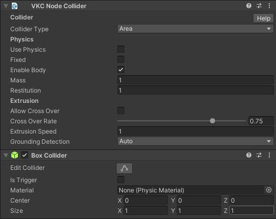

# VKC Item Area Collider

VKC Item Area Colliderは、オブジェクトに対してアクションを導入することができるコンポーネントです。 
コライダーにプレイヤーが進入した際にアクションを実行します。

VKC Item Area Colliderをアタッチするオブジェクトには[VKC Node Collider](./VKCNodeCollider.md)とColliderがアタッチされている必要があります。 
なお、VKC Item Area Colliderをオブジェクトにアタッチすると[VKC Node Collider](./VKCNodeCollider.md)とBox Colliderが自動で追加されます。 
[VKC Node Collider](./VKCNodeCollider.md)のtypeはAreaに設定されている必要があります。

`Actions on Enter`, `Actions on Leave`それぞれにおいてAdd(+ボタン)をクリックすることで任意のアクションを設定できます。 
反対に、Delete(-ボタン)をクリックすることで最後尾のアクションを削除できます。

|  名称 |  機能  |
| ----   | ---- |
| Actions on Enter | エリア進入時のアクションを設定します。 |
| Actions on Leave | エリア退出時のアクションを設定します。 |

アクションについては[アクションの概要](../Actions/ActionsOverview.md)を参照してください。 
コライダーについては[Unity制作ガイドライン - コライダー](../WorldMakingGuide/UnityGuidelines.md)を参照してください。

???+ note "このオブジェクトタイプを使用可能なItemクラス"
    - [Equals](../hs/hs_class_item.md#equals)
    - [GetName](../hs/hs_class_item.md#getname)
    - [SetPos](../hs/hs_class_item.md#setpos)
    - [GetPos](../hs/hs_class_item.md#getpos)
    - [SetQuaternion](../hs/hs_class_item.md#setquaternion)
    - [GetQuaternion](../hs/hs_class_item.md#getquaternion)
    - [SetShow](../hs/hs_class_item.md#setshow)
    - [IsShow](../hs/hs_class_item.md#isshow)
    - [Load](../hs/hs_class_item.md#load)
    - [Unload](../hs/hs_class_item.md#unload)
    - [SetEnableCollider](../hs/hs_class_item.md#setenablecollider)
    - [IsEnableCollider](../hs/hs_class_item.md#isenablecollider)
    - [ReplaceItem](../hs/hs_class_item.md#replaceitem)
    - [IsEnableCollider](../hs/hs_class_item.md#isenablecollider)
    - [SetProperty](../hs/hs_class_item.md#setproperty)
    - [GetProperty](../hs/hs_class_item.md#getproperty)
    - [CallComponentMethod](../hs/hs_class_item.md#callcomponentmethod)
    - [SetOverridesProperty](../hs/hs_class_item.md#setoverridesproperty)
    - [GetOverridesProperty](../hs/hs_class_item.md#getoverridesproperty)

## 詳細設定

| 名称 | 初期値 |  説明  |
| ---- | ---- | ---- |
| Show | True | VKC Item Area Colliderでは動作しません。 |
| Clickable | False | VKC Item Area Colliderでは動作しません。 |
| Auto Loading | True | 動的ローディングの有効/無効を切り替えます。 |
| Item Render Priority | 0 | ワールド内のItemの描画優先度を変更できます。 |
| Show Photo Mode | True | VKC Item Area Colliderでは動作しません。 |

## コライダーの衝突 / エリア範囲判定について

ワールド内でのコライダーの衝突 / エリア範囲判定は、画像のオレンジ球の一番下の地点、プレイヤーの足元の原点位置にて判定されます。 
また、以下のようなコリジョンの可視化は[VketCloudSettings / BasicSettings](../VketCloudSettings/BasicSettings.md)から[デバッグモード](../WorldEditingTips/DebugMode.md#f3)を有効にした上でF3キーを押すと切り替えできます。

!!! warning "コライダーが動作しない場合"
    コライダーが地面から少しでも浮いている場合、プレイヤーの足元(原点)にて判定される衝突が動作しません。 
    もしコライダーが動作しない場合、地面からコライダーが浮いていないかを確認してください。
