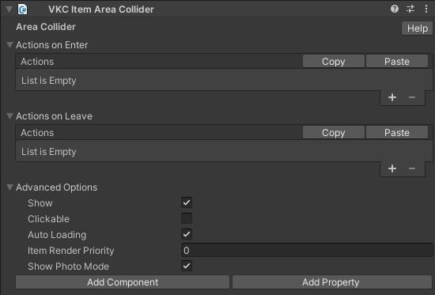

# VKC Item Area Collider

VKC Item Area Colliderは、オブジェクトに対してアクションを導入することができるコンポーネントです。 
コライダーにプレイヤーが進入したことをトリガーとして様々なアクションを設定可能です。 
アクションについては[アクションの概要](../Actions/ActionsOverview.md)を参照してください。 

## 設定項目

`Actions on Enter`, `Actions on Leave`それぞれにおいてAdd(+ボタン)をクリックすることで任意のアクションを設定できます。 
反対に、Delete(-ボタン)をクリックすることで最後尾のアクションを削除できます。

|  名称 |  機能  |
| ----   | ---- |
| Actions on Enter | エリア進入時のアクションを設定します。 |
| Actions on Leave | エリア退出時のアクションを設定します。 |

アクションについては[アクションの概要](../Actions/ActionsOverview.md)を参照してください。 
コライダーについては[Unity制作ガイドライン - コライダー](../WorldMakingGuide/UnityGuidelines.md)を参照してください。

???+ note "このオブジェクトタイプを使用可能なItemクラス"
    - [Equals](../hs/hs_class_item.md#equals)
    - [GetName](../hs/hs_class_item.md#getname)
    - [SetPos](../hs/hs_class_item.md#setpos)
    - [GetPos](../hs/hs_class_item.md#getpos)
    - [SetQuaternion](../hs/hs_class_item.md#setquaternion)
    - [GetQuaternion](../hs/hs_class_item.md#getquaternion)
    - [SetShow](../hs/hs_class_item.md#setshow)
    - [IsShow](../hs/hs_class_item.md#isshow)
    - [Load](../hs/hs_class_item.md#load)
    - [Unload](../hs/hs_class_item.md#unload)
    - [SetEnableCollider](../hs/hs_class_item.md#setenablecollider)
    - [IsEnableCollider](../hs/hs_class_item.md#isenablecollider)
    - [ReplaceItem](../hs/hs_class_item.md#replaceitem)
    - [IsEnableCollider](../hs/hs_class_item.md#isenablecollider)
    - [SetProperty](../hs/hs_class_item.md#setproperty)
    - [GetProperty](../hs/hs_class_item.md#getproperty)
    - [CallComponentMethod](../hs/hs_class_item.md#callcomponentmethod)
    - [SetOverridesProperty](../hs/hs_class_item.md#setoverridesproperty)
    - [GetOverridesProperty](../hs/hs_class_item.md#getoverridesproperty)

### 高度な設定

| 名称 | 初期値 |  説明  |
| ---- | ---- | ---- |
| Show | True | VKC Item Area Colliderでは動作しません。 |
| Clickable | False | VKC Item Area Colliderでは動作しません。 |
| Auto Loading | True | 自動ローディングの有効/無効を切り替えます。 |
| Item Render Priority | 0 | ワールド内のItemの描画優先度を変更できます。 |
| Show Photo Mode | True | VKC Item Area Colliderでは動作しません。 |

## 使用上の注意
VKC Item Area Colliderは、以下の点に特に注意が必要です。 

### プレイヤーの足元よりも低い位置に配置する
エリアコライダーとの衝突判定は「プレイヤーの足元」にあります。 
もし衝突検知しない場合、地面からコライダーが浮いていないか確認してください。  

図の左側のコライダーは、地面から浮いているため衝突検知しません。右側のコライダーのように地面に接触するよう位置を下げる必要があります。 

### VKC Item Fieldコンポーネントをもつオブジェクトの子として配置する
VKC Item Area Colliderをアタッチしたオブジェクトは、VKC Item Fieldコンポーネントをアタッチした他のオブジェクトの配下に置く必要があります。 
もし衝突検知しない場合、Unityのヒエラルキー上で親子関係を確認してください。 

図のように、ItemFieldコンポーネントを持つ「World」オブジェクトの配下にオブジェクトを移動してください。

!!! note "VKC Item Fieldオブジェクトの階層下に置く理由"
    VKC Item Fieldは、コライダーなどの形状を出力するために使用されます。
    逆にArea Collider単体だと、コライダーの形状をビルド時に含めることができません。