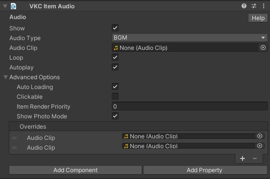
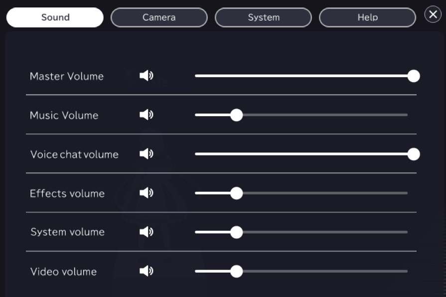

# VKC Item Audio

| Label | Default | Function  |
| ----  | ----  | ---- |
| Audio Type | BGM | Choose from BGM, SE, or SystemSE |
| Audio Clip |  | Specify the audio file.   Currently, only mp3 files are supported. |
| loop | False | Set if you want it to loop. |
| autoplay | False | If you want the audio to play automatically after joining. e.g. world BGM. |

Each `Audio Type` matches the In-game config label.

|  Audio Type |  In-game config label  |
| ----   | ---- |
| `BGM` | Music |
| `SE` | Effects |

By accessing the in-game config, the player may set the volume of each audio type.

## Advanced Options

| Label | Default | Function |
| ---- | ---- | ---- |
| Auto Loading | True | Toggles dynamic loading on/off. |
| Clickable | False | Makes the item clickable. |
| Item Render Priority | 0 | Allows changing the rendering priority of the item in the world. |
| Show Photo Mode | True | Specifies whether the item is displayed in photography mode. |
| Override | - | When entering the world, the Audio Clip set in `Overrides` will be used instead of the `Audio Clip` set in VKC Item Audio. |

## Audio file format

When setting an audio file, please follow the format below:

| Label | Value |
| ---- | ---- |
| File format | .mp3 |
| Sampling rate | 44100 Hz |
| Bit rate | 160 kbps |

!!! note caution
    Upon using VKC Item Audio for playing BGM, consider the following:

    - When a video file is playing, the video audio will be prioritized.
    - SDK does not support distance falloff.
