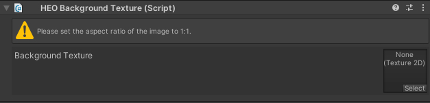
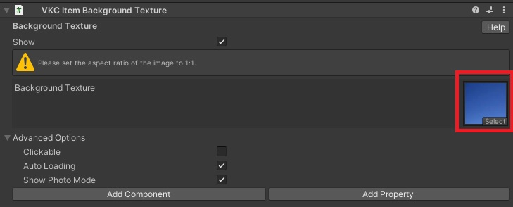

# VKC Item Background Texture

This component will display the designated image to the scene background. 
The image will not shift on player movement like Skybox, and position will be constant.

Please make sure that the designated image has a 1:1 aspect ratio.

For example, a sky image having a 1:1 aspect ratio is used as the scene background:

???+ note "Available methods for this object type"
    - [Equals](../hs/hs_class_item.md#equals)
    - [GetName](../hs/hs_class_item.md#getname)
    - [SetPos](../hs/hs_class_item.md#setpos)
    - [GetPos](../hs/hs_class_item.md#getpos)
    - [SetQuaternion](../hs/hs_class_item.md#setquaternion)
    - [GetQuaternion](../hs/hs_class_item.md#getquaternion)
    - [Load](../hs/hs_class_item.md#load)
    - [Unload](../hs/hs_class_item.md#unload)
    - [IsLoading](../hs/hs_class_item.md#isloading)
    - [IsLoaded](../hs/hs_class_item.md#isloaded)
    - [ReplaceItem](../hs/hs_class_item.md#replaceitem)
    - [SetProperty](../hs/hs_class_item.md#setproperty)
    - [GetProperty](../hs/hs_class_item.md#getproperty)
    - [CallComponentMethod](../hs/hs_class_item.md#callcomponentmethod)
    - [SetOverridesProperty](../hs/hs_class_item.md#setoverridesproperty)
    - [GetOverridesProperty](../hs/hs_class_item.md#getoverridesproperty)

### Advanced Settings

| Label | Initial Value | Function |
| ---- | ---- | ---- |
| Clickable | false | Toggles acceptance of click input from player |
| Auto Loading | true | Toggles auto loading enable/disable |
| Show Photo Mode | true | Toggles display/hide item when in photo mode |

!!! info "Note"
    For more details, please refer to the following page:
    - [How to Use VKC Item Background Texture](../WorldMakingGuide/BackgroundTexture.md)
