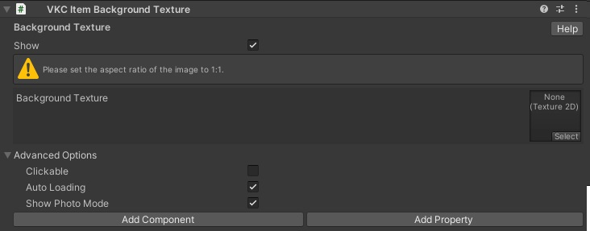

# VKC Item Background Texture

設定した画像をシーンの背景として配置するために使用するコンポーネントです。 
Skyboxのように上下左右で画像は変わらず、常に同じ画像が投影されるためご注意ください。

また、使用する画像の比率は必ず**『1 : 1』**にしてください。

例として、ここでは1 : 1にフォーマットされた空の画像を使用してシーン背景として設定しております。

???+ note "このオブジェクトタイプを使用可能なItemクラス"
    - [Equals](../hs/hs_class_item.md#equals)
    - [GetName](../hs/hs_class_item.md#getname)
    - [SetPos](../hs/hs_class_item.md#setpos)
    - [GetPos](../hs/hs_class_item.md#getpos)
    - [SetQuaternion](../hs/hs_class_item.md#setquaternion)
    - [GetQuaternion](../hs/hs_class_item.md#getquaternion)
    - [Load](../hs/hs_class_item.md#load)
    - [Unload](../hs/hs_class_item.md#unload)
    - [IsLoading](../hs/hs_class_item.md#isloading)
    - [IsLoaded](../hs/hs_class_item.md#isloaded)
    - [ReplaceItem](../hs/hs_class_item.md#replaceitem)
    - [SetProperty](../hs/hs_class_item.md#setproperty)
    - [GetProperty](../hs/hs_class_item.md#getproperty)
    - [CallComponentMethod](../hs/hs_class_item.md#callcomponentmethod)
    - [SetOverridesProperty](../hs/hs_class_item.md#setoverridesproperty)
    - [GetOverridesProperty](../hs/hs_class_item.md#getoverridesproperty)

### 高度な設定

| 名称 | 初期値 | 機能 |
| ---- | ---- | ---- |
| Clickable | false | オブジェクトがクリックされた際の判定を発生させるか否かを設定します。 |
| Auto Loading | true | [動的ローディング](VKCItemField.md)にて使用します。  デフォルトはtrueで初回ローディング時に読み込まれます。 |
| Show Photo Mode | true | 写真撮影モードの際、Activityを表示するかどうかを変更します |

!!! info "Note"
    使い方の詳細は以下ページをご参照ください。
    - [VKC Item Background Textureの使い方](../WorldMakingGuide/BackgroundTexture.md)
