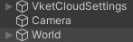

# VKC Item Camera


VKC Item Cameraコンポーネントは演出目的等で通常のカメラから別のカメラ制御に切り替えるために使用します。<br>
この機能を使うことにより、イベントシーンなどでのカメラの切り替えや特殊カメラワークを作ることができます。<br>
カメラの切り替えは後述するようにHeliScriptからおこないます。

| 名称 | 初期値 | 機能 |
| ---- | ---- | ----|
| Position | 0,0,0 | カメラのGlobal座標を保管します |
| Rotation | 0,0,0 | カメラのGlobal回転値を保管します |

## 使い方

1\. 空のGameObjectを作成し、VKC Item Cameraコンポーネントをアタッチしてシーン上に配置します。


なお、本オブジェクトはHEOFieldとは別個の[アイテム](../hs/hs_class_item.md)として扱われるため、Worldオブジェクトの外に置かれても問題ございません。




2\. HeliScriptを書く

VKC Item Cameraをアタッチした空オブジェクトはアイテムとして出力されます。
そのため、[SetPos](../hs/hs_class_item.md#setpos)や[SetQuaternion](../hs/hs_class_item.md#setquaternion)といったアイテムクラス用の関数を使用することができるほか、[Camera専用の関数](../hs/hs_class_item.md#setcamera)も使用することが可能です。

!!! note "Camera専用の関数"
    1. bool SetCamera()<br>
    現在の映像を映すカメラを該当のカメラアイテムにします。<br>
    成功したらtrue、失敗したらfalseが返ってきます。

    2. void ResetCamera()<br>
    現在の映像を映すカメラをデフォルトのプレイヤー追従のものに戻します。

上記の関数を利用したHeliScriptの例が下記になります。

```cs
component EventCameraTest
{
    Item m_Camera;
    bool is_evented;
    float Timer;

    public EventCameraTest()
    {
        m_Camera = hsItemGet("CameraObj");
        is_evented = false;
    }

    public void Update()
    {
        Timer += 10*hsSystemGetDeltaTime();
        m_Camera.SetPos(makeVector3(7*hsMathSin(DEGtoRAD(Timer)),2,7*hsMathCos(DEGtoRAD(Timer))));
        m_Camera.SetQuaternion(makeQuaternionYRotation(DEGtoRAD(Timer + 180)));
    }

    public void ChangeCamera(string dummy){
        is_evented = !is_evented;
        if(is_evented){
            m_Camera.SetCamera();
        }else{
            m_Camera.ResetCamera();
        }
    }
}
```

これを実装したシーンが下記のようになります。<br>
イベントカメラが有効となっている時、ワールドの中心を軸として回転するカメラワークとなります。<br>
以下の画像ではSphereに[CallScript](../Actions/Programmatic/CallScript.md)を入れており、クリックするたびカメラが切り替わるように実装されています。


## その他知見

イベントカメラには下記の特徴があります。

- プレイヤーの操作はカメラの影響を受ける
- 一人称視点にするとプレイヤーはカメラの位置にワープする

したがって、イベントカメラを使用する場合は、UIの操作を制限するか、プレイヤーの動きを制限しておかないと、予期せぬ動作の元となってしまいます。
